# Руководство: быстрый старт

Все примеры, приведённые ниже, предполагают, что вы уже зарегистрировались и вошли на платформу.

Если вы еще не зарегистрировались или не выполнили вход, следуйте инструкциям из раздела [Регистрация](../3-start/01-register.md)

После регистрации в MarketAut автоматически создаётся первая диаграмма. Она будет доступна сразу после входа в систему и может использоваться как основа для настройки ваших интеграций.

## Подключение Claude к магазину Wildberries

### Получение API-токена Wildberries

Любая интеграция с Wildberries начинается с создания API-токена. Он позволяет получать данные из магазина Wildberries и выполнять действия от его имени.

> Подробнее об интеграции с Wildberries см. в разделе [Типы аккаунтов](../4-platform/02-account-types.md).

> ⚠️ **ВАЖНО:** для создания токена вы должны быть  владельцем личного кабинета Wildberries.

Перейдите на [Портал продавца Wildberries](https://seller.wildberries.ru) и откройте раздел [Интеграции по API](https://seller.wildberries.ru/api-integrations). 
Нажмите **+ Создать токен**. 

В открывшемся окне выберите **Для интеграции вручную**, затем — **Базовый токен**. 

Укажите любое удобное для вас название токена и выберите разделы, к которым он будет иметь доступ. 

Для работы всех функций MarketAut необходимо выбрать:
- **Контент**
- **Цены и скидки** 
- **Документы**

После выбора разделов нажмите **Создать токен** и скопируйте полученный токен в буфер обмена (**Ctrl+C или Command+C**) — он понадобится на следующем шаге.

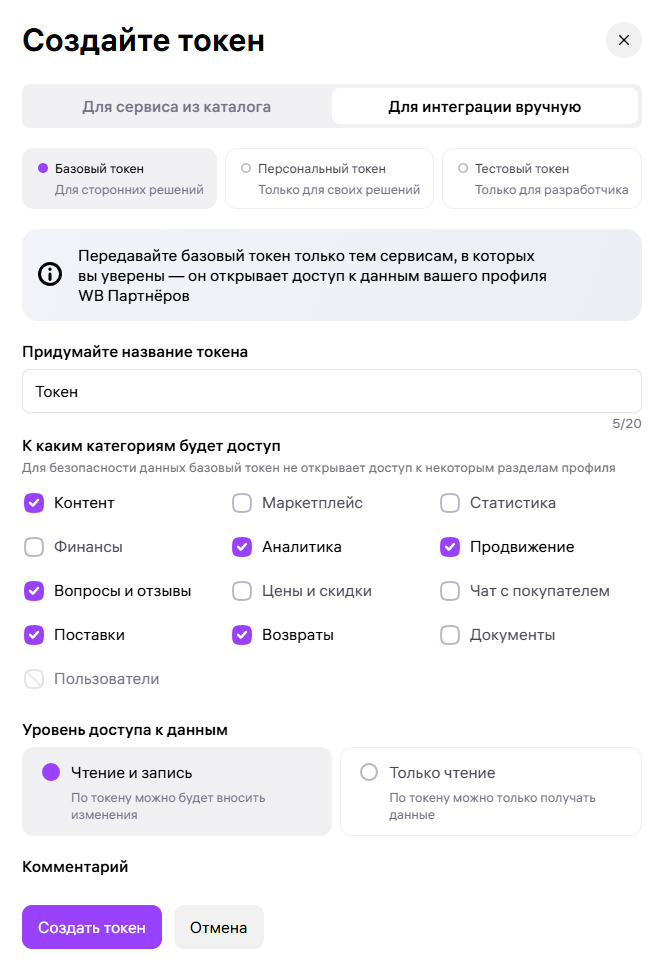

### Создаём аккаунт для подключения к Wildberries 

Теперь необходимо создать аккаунт для подключения к магазину Wildberries.

**Аккаунт** — это набор данных для подключения к магазину (например, API-токен). Его можно использовать в узлах диаграммы, которым требуется доступ к Wildberries.

> Подробнее об аккаунтах см. в разделе [Аккаунты](../4-platform/01-accounts.md).

В интерфейсе **MarketAut** перейдите в раздел  [Конфигурация → Аккаунты](https://marketaut.ru/app/config/accounts).

Нажмите кнопку **+ Добавить аккаунт**.

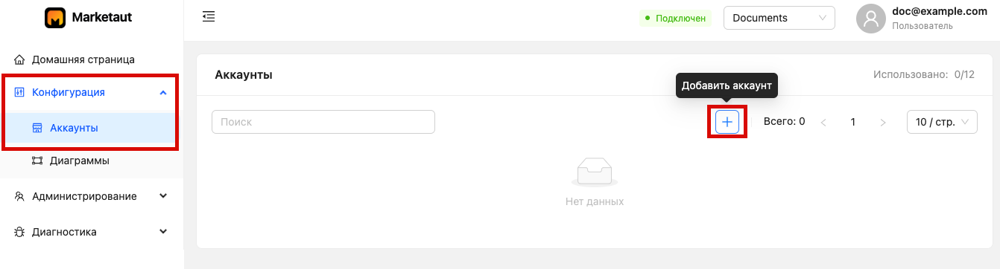

В поле **Тип аккаунта** выберите **Wildberries** и заполните следующие поля:

**Название** — обязательное поле. Укажите любое удобное для вас название, например «Магазин».
**Описание** — необязательное поле. При необходимости можно указать произвольное  описание.
**API Token** — вставьте API-токен, полученный в личном кабинете продавца Wildberries на предыдущем шаге.

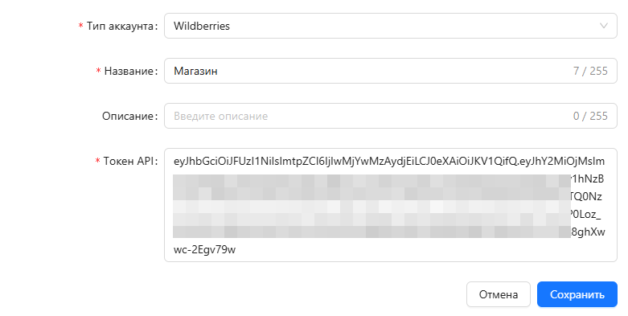

Нажмите кнопку **Сохранить**.
После сохранения созданный аккаунт отобразится в списке аккаунтов.

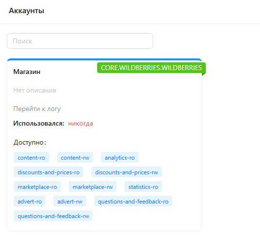
На карточке аккаунта синим цветом отображаются разделы API, к которым у токена есть доступ.
### Создаём диаграмму для ИИ-агента

После регистрации первая диаграмма уже создаётся автоматически. При необходимости вы можете создать новую диаграмму вручную.

> Подробнее о диаграммах можно прочитать в разделах [Диаграммы](../4-platform/03-diagrams.md) и [Настройка диаграммы](../4-platform/04-diagrams-edit.md).

В интерфейсе **MarketAut** перейдите в раздел  [Конфигурация → Диаграммы](https://marketaut.ru/app/config/diagrams).

Нажмите кнопку **+ Добавить диаграмму**.

Заполните следующие поля:
**Название** — обязательное поле. Укажите любое удобное для вас название, например «Агент по товарам».
**Описание** — необязательное поле. При необходимости можно указать произвольное описание.

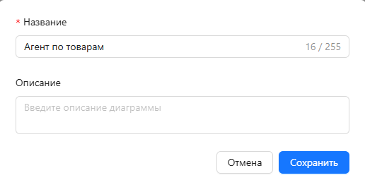

Нажмите кнопку **Сохранить**. 

После сохранения в списке диаграмм появится новая диаграмма со статусом «**Не сконфигурирована**».

Для перехода к настройке диаграммы нажмите кнопку открытия со значком квадрата.

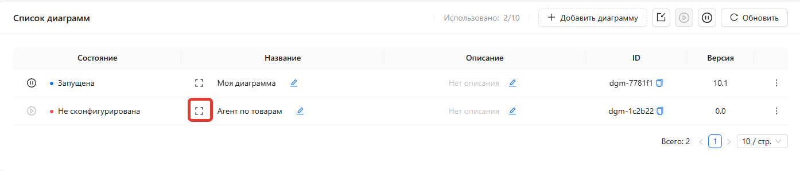

Перед вами откроется пустой холст диаграммы, на котором необходимо разместить и настроить узлы.

### Настройка диаграммы

Добавим на диаграмму узлы Wildberries и ИИ-агента.

> Подробнее о настройке диаграмм можно прочитать в разделе [Настройка диаграммы](../4-platform/04-diagrams-edit.md).

На панели инструментов нажмите кнопку **«Добавить узел (+)»**.

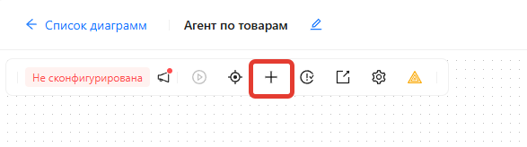

В списке доступных узлов выберите **Каталог товаров** и нажмите **Добавить**.
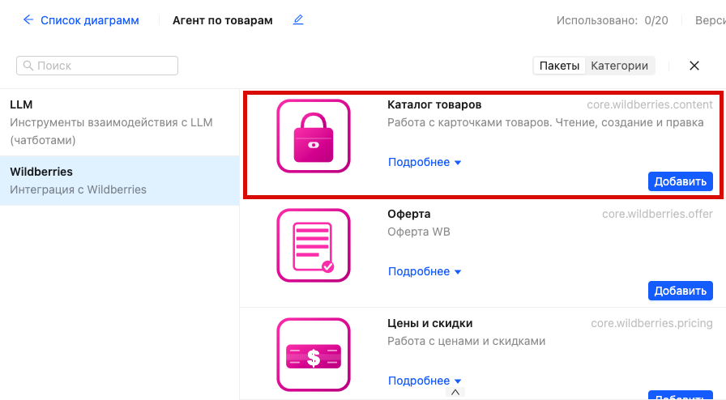

Мы добавили узел **Каталог товаров**, который позволяет работать с карточками товаров Wildberries.

Теперь необходимо указать, с каким магазином будет работать этот узел. Для этого нужно привязать к нему аккаунт, созданный ранее.

При необходимости вы можете работать сразу с несколькими магазинами Wildberries, создав отдельный аккаунт для каждого из них.

Для привязки аккаунта:

1. Выберите узел **Каталог товаров** на диаграмме;
2. В правой части экрана откроется панель его настроек;
3. Перейдите на вкладку **Аккаунты**;
4. В выпадающем списке выберите нужный аккаунт;
5. Нажмите **Сохранить**.

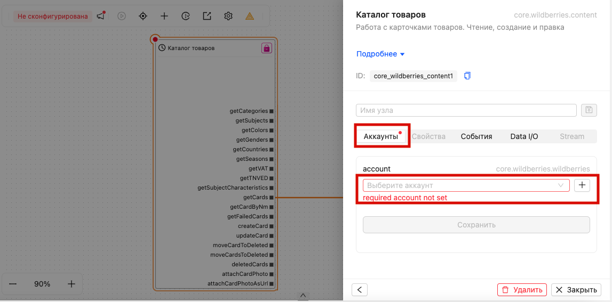

Теперь аналогичным образом добавьте узел **MCP**.

Узел **MCP** обеспечивает взаимодействие между вашим ИИ и платформой **MarketAut**. Через него ИИ получает доступ к инструментам, подключённым на диаграмме.

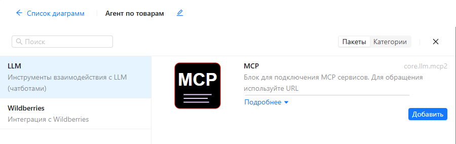

Для узла **MCP** необходимо указать идентификатор в поле **ID**.

Этот идентификатор будет использоваться при подключении ИИ к данному узлу.

При необходимости вы можете создать несколько узлов **MCP** с разными идентификаторами, например `content`, `legal`, `wb`. Это позволит подключать к ИИ разные наборы инструментов независимо друг от друга.

Выберите узел **MCP** на диаграмме.

В правой части экрана откроется панель его настроек. На вкладке **Свойства** в поле **ID** введите значение `wb` и нажмите **Сохранить**.

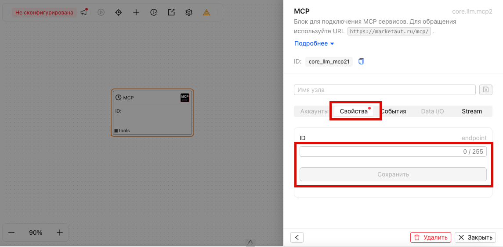

Узлы настроены. Теперь необходимо определить, к каким инструментам получит доступ ИИ.

Каждый выход узла **Каталог товаров** представляет собой отдельный инструмент.

Например:

- `cards`- получение списка карточек товаров;
- `getCardByNm`-  получение информации о карточке товара по её артикулу;
- `createCard`- создание новой карточки товара;
- `updateCard`- изменение существующей карточки товара.

Вы можете предоставить ИИ доступ к любому набору инструментов.

В рамках данного примера дадим ИИ доступ к получению списка карточек товаров через инструмент `cards`и просмотру информации о конкретной карточке через инструмент `getCardByNm`.

Для этого соедините выходы `getCards` и `getCardByNm` со входом `tools` узла **MCP**.

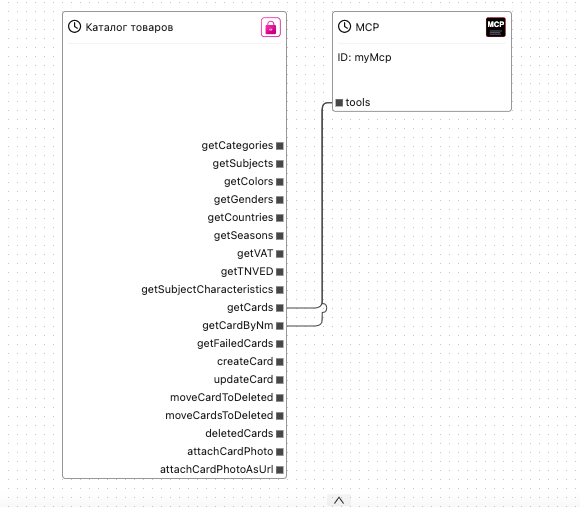

**Готово**

Теперь необходимо запустить диаграмму.

Запуск переводит диаграмму из режима настройки в рабочий режим. После запуска ИИ сможет использовать инструменты, подключённые к узлу **MCP**.

Для запуска диаграммы нажмите кнопку **Запустить** в верхней части окна.

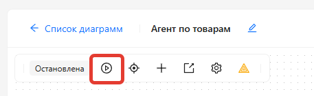

### Подключение ИИ

После настройки и запуска диаграммы остаётся подключить её к ИИ. В качестве примера будем использовать **Claude**.

> Подробнее о процессе подключения можно прочитать в разделе [Подключение Claude](../5-ai/01-claude.md).

В данном руководстве мы не будем подробно рассматривать процесс подключения, так как он описан в отдельном разделе.

⚠️ **ВАЖНО** — для подключения **Claude** (или любого другого ИИ с поддержкой **MCP**) потребуется адрес подключения к **MCP**.

Этот адрес формируется на основе значения **ID**, указанного при настройке узла **MCP**.

Например, если в поле **ID** было указано значение `wb`, то адрес подключения будет следующим:

**`https://marketaut.ru/mcp/wb`**

Если указано другое значение, адрес подключения будет отличаться.

Текущий адрес подключения всегда можно посмотреть в настройках узла **MCP**, выбрав этот узел на диаграмме.

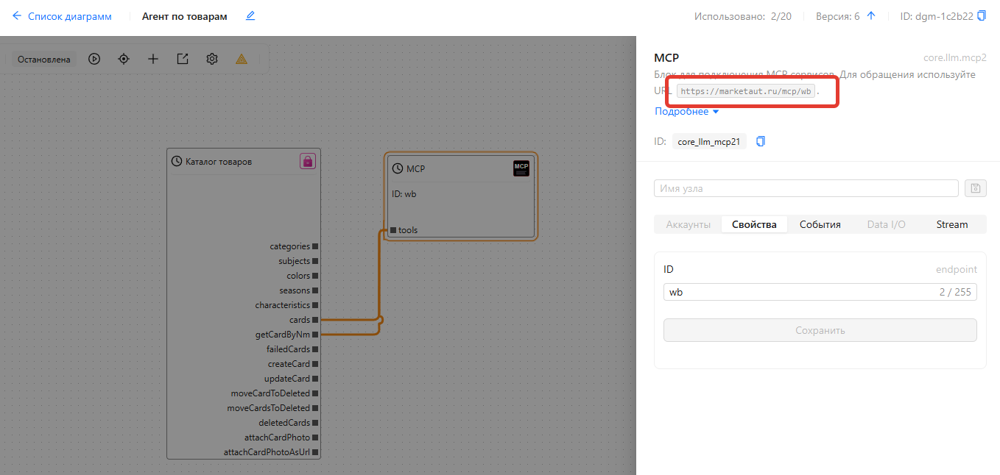

При добавлении **connector** (коннектора) в **Claude** укажите это значение:

После подключения в списке доступных инструментов Claude будут доступны `cards` и `getCardByNm`:

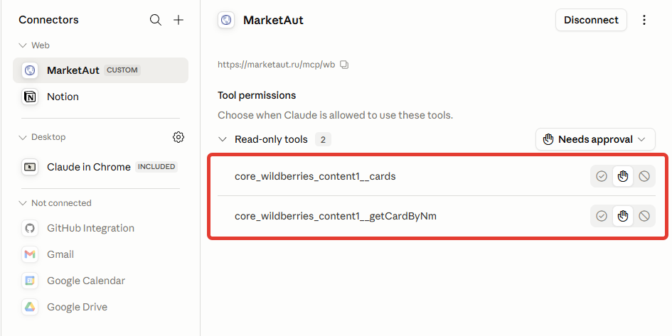

### Проверка

Подключение завершено.

Чтобы убедиться, что всё работает корректно, задайте ИИ любой вопрос о товарах вашего магазина, например:

> Какие товары есть у меня в магазине?

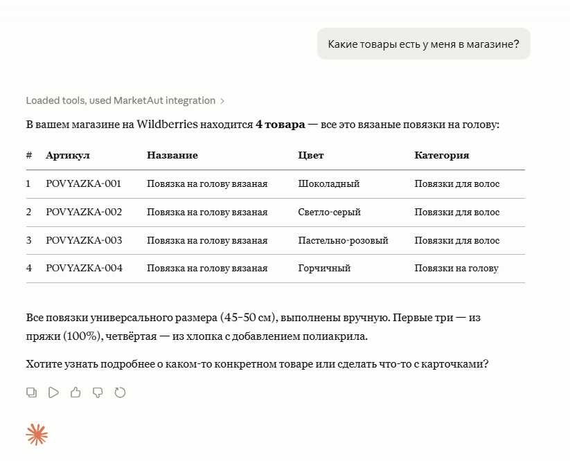

