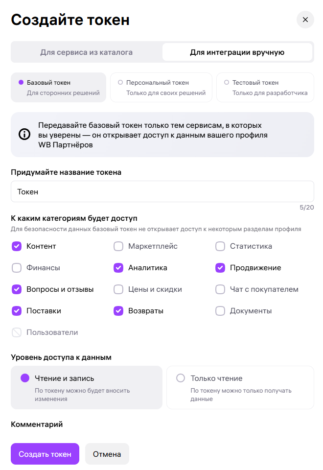
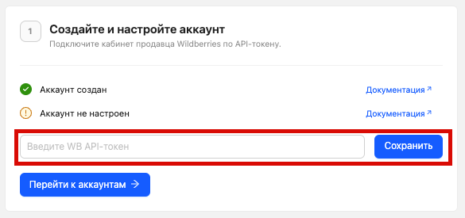
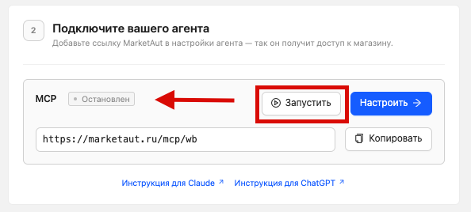
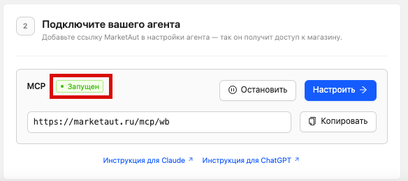
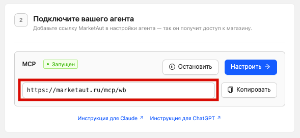
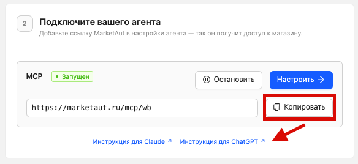
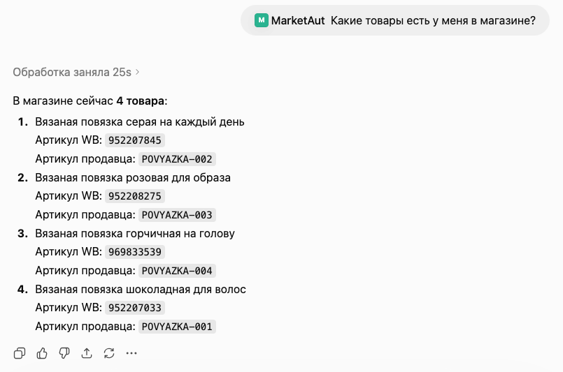

# Руководство: быстрый старт

Это руководство поможет подключить магазин Wildberries к ChatGPT и начать использовать возможности ИИ для работы с вашим магазином.

Все примеры, приведённые ниже, предполагают, что вы уже зарегистрировались и вошли на платформу.

Если вы еще не зарегистрировались или не выполнили вход, следуйте инструкциям из раздела [Регистрация](../3-start/01-register.md)

После регистрации в MarketAut первый **Аккаунт** и первая **Диаграмма** создаются автоматически.

**Вам не нужно создавать их вручную — достаточно получить API-токен Wildberries, добавить его в аккаунт, запустить агента и подключить ChatGPT.**

## Что потребуется  

Перед началом убедитесь, что у вас есть:

- учетная запись MarketAut; 
- учетная запись ChatGPT; 
- доступ к личному кабинету продавца Wildberries. 
## Получение API-токена Wildberries

Любая интеграция с Wildberries начинается с создания API-токена. Он позволяет получать данные из магазина Wildberries и выполнять действия от его имени.

> Подробнее об интеграции с Wildberries см. в разделе [Типы аккаунтов](../4-platform/02-account-types.md).

> ⚠️ **ВАЖНО:** для создания токена вы должны быть  владельцем личного кабинета Wildberries.

Перейдите на [Портал продавца Wildberries](https://seller.wildberries.ru) и откройте раздел [Интеграции по API](https://seller.wildberries.ru/api-integrations). 
Нажмите **+ Создать токен**. 

В открывшемся окне выберите **Для интеграции вручную**, затем — **Базовый токен**. 

Укажите любое удобное для вас название токена и выберите разделы, к которым он будет иметь доступ. 

Для работы всех функций MarketAut необходимо выбрать:

- Контент;
- Цены и скидки; 
- Документы.

После выбора разделов нажмите **Создать токен** и скопируйте полученный токен в буфер обмена (**Ctrl+C или Command+C**) — он понадобится на следующем шаге.

>Подробнее о получении API-токена см. в разделе [Получение API-токена](../3-start/03-api-token.md).
## Настройка аккаунта MarketAut

После получения API-токена необходимо добавить его в MarketAut.

Откройте главную страницу MarketAut. 

В блоке **«Создайте и настройте аккаунт»** вставьте полученный API-токен в соответствующее поле и нажмите **«Сохранить»**. 

После сохранения аккаунт будет готов к работе.

> Подробнее об аккаунтах см. в разделе [Аккаунты](../4-platform/01-accounts.md).

## Запуск диаграммы для ИИ-агента

После настройки аккаунта необходимо запустить агента.

В блоке **«Подключите вашего агента»** нажмите **«Запустить»**, если агент еще не запущен. 

После запуска статус агента изменится на **«Запущен»**.

> Подробнее о диаграммах см. в разделах [Диаграммы](../4-platform/03-diagrams.md) и [Настройка диаграммы](../4-platform/04-diagrams-edit.md).

## Подключение ChatGPT

После настройки аккаунта и запуска агента подключите MarketAut к ChatGPT.

> Подробнее о процессах подключения можно прочитать в разделе [Работа с ИИ](../5-ai/00-intro.md).

В данном руководстве мы не будем подробно рассматривать процесс подключения, так как он описан в отдельном разделе.

⚠️ **ВАЖНО** — для подключения **ChatGPT** (или любого другого ИИ с поддержкой **MCP**) потребуется адрес подключения к **MCP**.

Текущий адрес подключения всегда можно посмотреть на домашней странице.

На главной странице MarketAut в блоке **«Подключите вашего агента»** нажмите **«Копировать»**, чтобы скопировать адрес подключения.

Далее выполните следующие действия в ChatGPT:
1. Перейдите в раздел **«Плагины»**;
2. Нажмите кнопку **«+»** в правом верхнем углу;
3. Введите название приложения, например **MarketAut**;
4. Вставьте скопированный адрес подключения;
5. Подтвердите согласие и нажмите **«Создать приложение»**; 
6. Обновите список инструментов и дождитесь появления приложения **MarketAut**.

>Подробнее о подключении см. в разделе [Подключение ChatGPT](../5-ai/02-chat-gpt.md).

## Проверка подключения 

1. Откройте новый чат;
2. Нажмите **«+»** рядом с полем ввода сообщения;
3. Выберите приложение **MarketAut**. После этого ChatGPT будет готов к работе с вашим магазином Wildberries.

Чтобы убедиться, что всё работает корректно, задайте ИИ любой вопрос о товарах вашего магазина, например:

> Какие товары есть у меня в магазине?

Подключение завершено.
