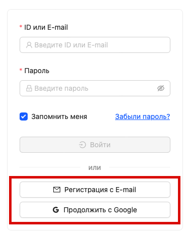
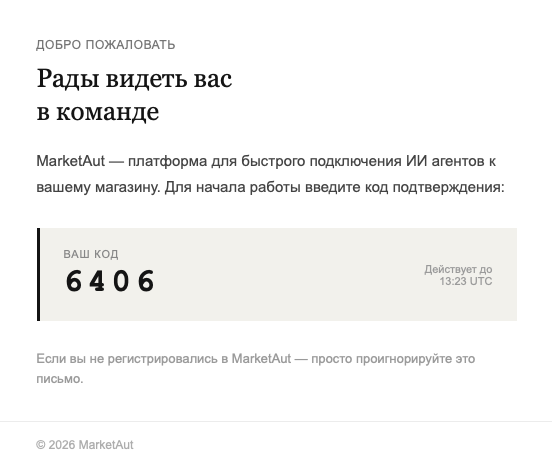
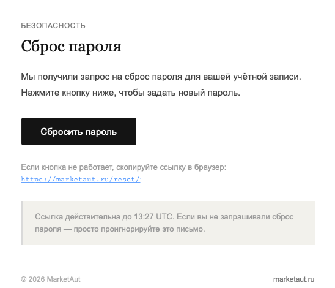

# Регистрация

В настоящее время доступны следующие способы регистрации:

- Адрес электронной почты 
- Учётная запись Google

Для регистрации по электронной почте:

1. Перейдите на Главную страницу;
2. Укажите адрес электронной почты и придумайте пароль;
3. Нажмите **Зарегистрироваться**;
4. Введите код подтверждения из письма;
5. После успешного подтверждения будет создана ваша учётная запись MarketAut.

Для регистрации через Google:

1. Перейдите на [Главную страницу](https://marketaut.ru);
2. Нажмите **Продолжить с Google**;
3. Выберите учётную запись Google или выполните вход в неё;
4. После успешной авторизации будет создана ваша учетная запись MarketAut.

При регистрации по адресу электронной почты на указанный email будет отправлено письмо с кодом подтверждения. Введите полученный код для завершения регистрации и создания учётной записи MarketAut.

Если письмо не пришло в течение нескольких минут:

- Проверьте папку **Спам**;
- Убедитесь, что адрес электронной почты указан без ошибок;
- При необходимости запросите отправку письма повторно.

# Вход

Если вы уже зарегистрированы и ранее выполняли вход на этом устройстве, система автоматически авторизует вас при посещении сайта.

Если автоматическая авторизация не произошла (например, при входе с нового устройства или после выхода из аккаунта), выполните вход с помощью адреса электронной почты или учетной записи Google , использованных при регистрации.

# Восстановление пароля 

Если вы забыли пароль, нажмите **Восстановить пароль** на странице входа и укажите адрес электронной почты, который использовался при регистрации.

На указанный email будет отправлено письмо для сброса пароля.

В письме содержатся:

- Кнопка **Сбросить пароль** для создания нового пароля;
- Прямая ссылка для восстановления пароля на случай, если кнопка не открывается или работает некорректно.

Если письмо не пришло:

- Проверьте папки **Спам**;
- Убедитесь, что адрес электронной почты указан верно;
- Запросите письмо повторно через несколько минут.

> Обратите внимание: письма для подтверждения регистрации и восстановления пароля могут попадать в папку «Спам».