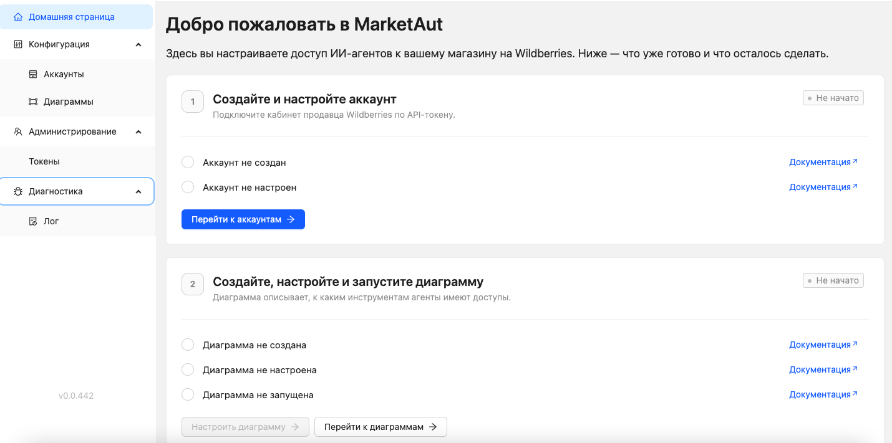
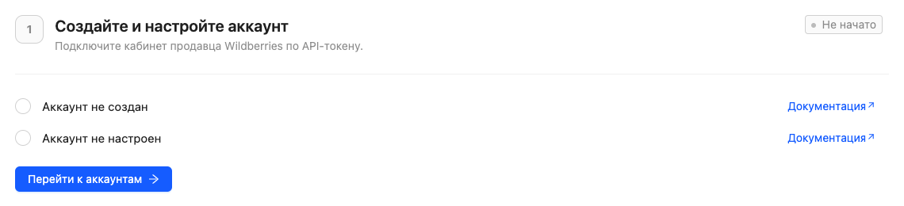
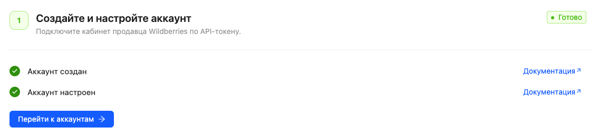
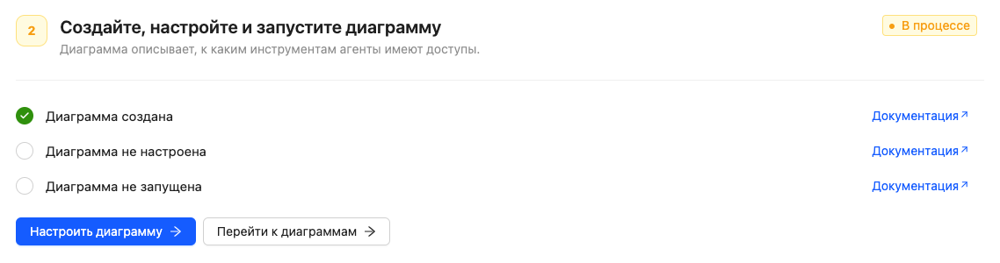
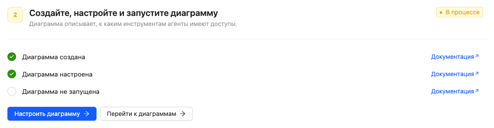
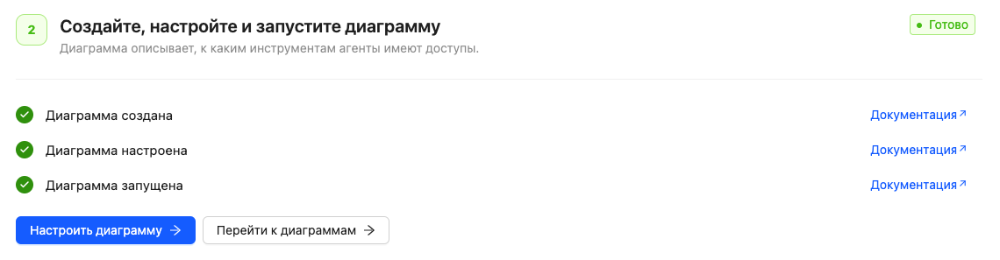
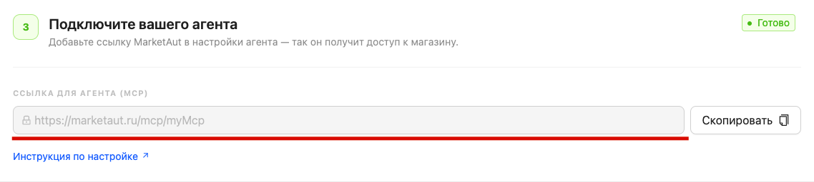

# Домашняя страница

После регистрации и входа в MarketAut пользователь автоматически попадает на домашнюю страницу. 

Домашняя страница помогает пройти первоначальную настройку системы и отображает текущий прогресс подключения.

На ней отображаются основные этапы настройки, которые необходимо выполнить перед подключением ИИ-агентов к магазину.

После успешного завершения каждого этапа соответствующие пункты будут отмечены зелёными галочками, а статус этапа изменится на **Готово**.

> Домашняя страница предназначена для первоначальной настройки системы.
> 
> Для начала работы обычно достаточно создать один аккаунт и одну диаграмму.
> 
> Если в дальнейшем потребуется создать дополнительные аккаунты или диаграммы, это можно сделать в разделах [Аккаунты](../4-platform/01-accounts.md) и [Диаграммы](../4-platform/03-diagrams.md).

## Статусы этапов

На домашней странице отображается текущий статус каждого этапа настройки:

- **Не начато** — настройка ещё не началась;
- **В процессе** — часть необходимых действий уже выполнена;
- **Готово** — этап успешно завершён.

После выполнения всех необходимых действий этап автоматически получает статус **Готово** и отмечается зелёными галочками.
## Подключение аккаунта 

Первым этапом необходимо подключить и настроить аккаунт Wildberries.

Если аккаунт ещё не создан или не настроен, домашняя страница отобразит соответствующие уведомления.

Для перехода к настройке используйте кнопку **Перейти к аккаунтам** или откройте раздел **Аккаунты** в меню платформы.

После успешного создания и настройки аккаунта все проверки будут отмечены зелёными галочками.

Для первоначальной настройки достаточно создать один аккаунт.

Если необходимо подключить несколько кабинетов Wildberries, дополнительные аккаунты можно создать в разделе [Аккаунты](../4-platform/01-accounts.md).
## Настройка диаграммы

После настройки аккаунта станет доступен следующий этап — создание диаграммы.

Диаграмма определяет, к каким инструментам и данным смогут обращаться подключённые ИИ-агенты.

Для перехода к настройке используйте кнопку **Перейти к диаграммам** или откройте раздел **Диаграммы** в меню платформы.

После создания диаграммы первый пункт будет отмечен как выполненный.

После настройки диаграммы будет отмечен следующий этап.

После запуска диаграммы все проверки будут успешно пройдены, а статус этапа изменится на **Готово**.

Для первоначальной настройки достаточно создать одну диаграмму.

Если потребуется создать дополнительные сценарии работы, отдельные наборы инструментов или несколько ИИ-агентов, дополнительные диаграммы можно создать в разделе [Диаграммы](../4-platform/03-diagrams.md).
## Получение MCP-адреса

После успешного создания аккаунта и запуска диаграммы становится доступен MCP-адрес для подключения ИИ-агентов.

Нажмите кнопку **Скопировать**, чтобы получить MCP-адрес.

Этот адрес потребуется при подключении Claude, ChatGPT, Gemini и других ИИ-агентов к платформе MarketAut.

## Что дальше? 

После получения MCP-адреса перейдите в раздел [Работа с ИИ](../5-ai/01-claude.md) и выберите используемого ИИ-агента.

Следуйте инструкции для выбранного сервиса, чтобы завершить подключение к MarketAut.