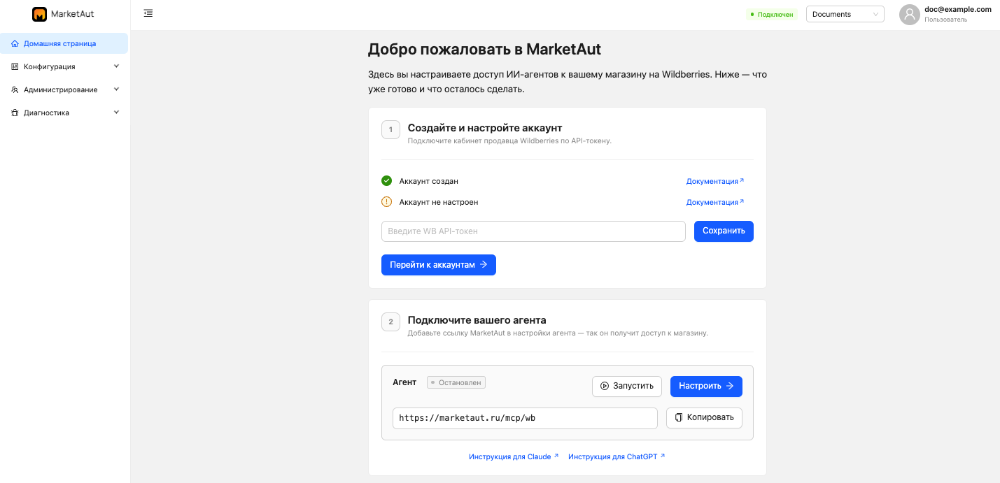
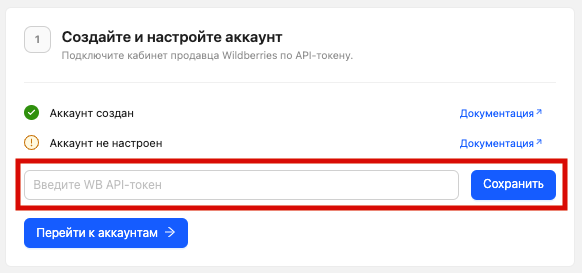
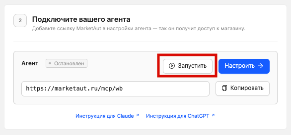
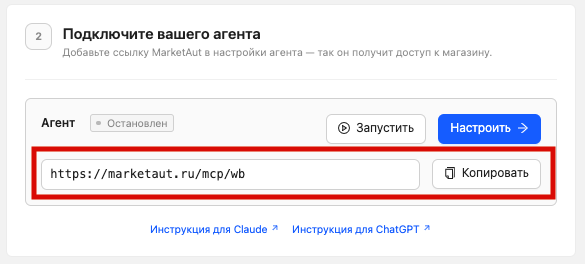

# Домашняя страница

После регистрации и входа в MarketAut пользователь автоматически попадает на домашнюю страницу. 

При регистрации платформа уже создаёт:

- один аккаунт Wildberries;
- одну диаграмму для подключения ИИ-агента.

Создавать их вручную для первоначальной настройки не нужно. Остаётся добавить API-токен Wildberries, запустить диаграмму и скопировать ссылку для подключения ИИ-агента.

## Добавление  API-токена Wildberries

В блоке **Создайте и настройте аккаунт** уже отображается автоматически созданный аккаунт.

Вставьте API-токен Wildberries в поле **Введите WB API-токен** и нажмите **Сохранить**.

После сохранения токена аккаунт будет настроен, а соответствующие пункты отметятся зелёными галочками.

Отдельно создавать аккаунт в разделе **Аккаунты** для первоначального подключения не требуется.

## Запуск диаграммы

Диаграмма также создаётся автоматически при регистрации. Настраивать или создавать её вручную для первоначального подключения не нужно.

После сохранения API-токена в блоке **Подключите вашего агента** нажмите **Запустить**.

После запуска статус диаграммы изменится, а ссылка для подключения ИИ-агента станет доступна.

## Ссылка MCP

В этом же блоке отображается ссылка для подключения агента к MarketAut.

Нажмите **Копировать**, чтобы сохранить её.

Эта ссылка потребуется при подключении Claude, ChatGPT или другого поддерживаемого ИИ-агента.
## Что дальше? 

После копирования ссылки перейдите в раздел [Работа с ИИ](../5-ai/00-intro.md) и выберите нужный сервис.

Для первоначальной настройки достаточно одного автоматически созданного аккаунта и одной диаграммы. При необходимости дополнительные аккаунты и диаграммы можно создать позже в соответствующих разделах платформы.