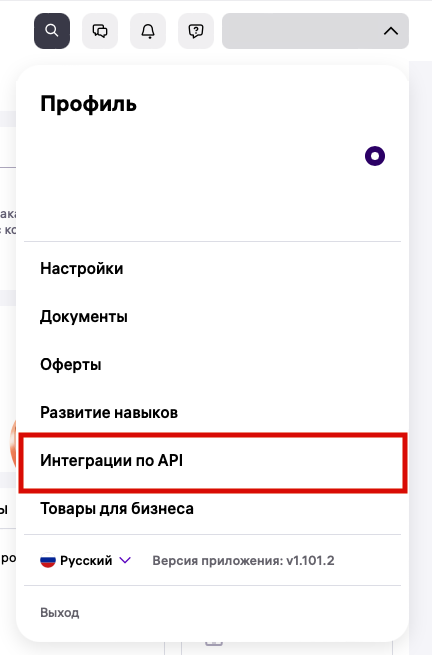
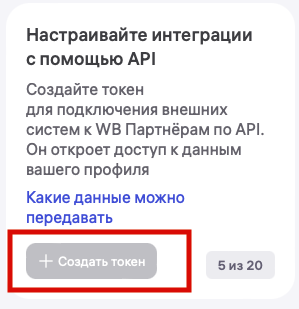

# Получение API-токена Wildberries

Любая интеграция с Wildberries начинается с создания API-токена. Он позволяет MarketAut получать данные из личного кабинета продавца и выполнять действия от его имени в рамках предоставленных разрешений.

⚠️ Создать API-токен может только владелец личного кабинета Wildberries.

Откройте [Портал продавца Wildberries](https://seller.wildberries.ru/) и войдите в личный кабинет.

В левом меню откройте раздел **«Настройки»**, затем выберите **«Интеграции по API»**.



Нажмите кнопку **«Создать токен»**.

Если API-токены уже создавались ранее, они будут отображаться на этой же странице.



В открывшемся окне перейдите на вкладку **«Для интеграции вручную»**.

Именно этот вариант используется для подключения MarketAut.

Выберите **«Базовый токен»**.

Этот тип токена предназначен для подключения сторонних сервисов и подходит для работы с MarketAut.

⚠️ Передавайте API-токен только тем сервисам, которым доверяете. Он предоставляет доступ к данным личного кабинета в пределах выбранных разрешений.


## Название токена

В поле **«Придумайте название токена»** укажите любое удобное название.

Например:

```text
MarketAut
```

Название используется только для удобства и помогает понять, для какого сервиса был создан токен.
## Категории доступа

Для корректной работы основных функций MarketAut отметьте следующие категории:

- **Контент**;
- **Вопросы и отзывы**;
- **Чат с покупателем**.

Каждая категория отвечает за определённые возможности:

| Категория | Для чего используется |
|---|---|
| Контент | Работа с карточками товаров, характеристиками и фотографиями |
| Вопросы и отзывы | Просмотр вопросов и отзывов покупателей, а также отправка ответов |
| Чат с покупателем | Получение и отправка сообщений покупателям |

## Уровень доступа

Для выбранных категорий установите уровень доступа **«Чтение и запись»**.

Такой уровень позволяет MarketAut:

- отвечать на отзывы и вопросы;
- отправлять сообщения покупателям;
- изменять данные карточек товара;
- загружать фотографии;
- выполнять другие доступные действия через API Wildberries.

Если выбрать вариант **«Только чтение»**, MarketAut сможет получать информацию, но не сможет вносить изменения.

## Создание и копирование токена

Проверьте выбранные параметры и нажмите кнопку **«Создать токен»**.

После создания нажмите **«Скопировать»**.

⚠️ После закрытия окна повторно посмотреть полный API-токен невозможно. Если токен не был сохранён, потребуется создать новый.

Не публикуйте API-токен в открытом доступе и не передавайте его третьим лицам.

## Добавление токена в MarketAut

Вернитесь в MarketAut и откройте настройки аккаунта Wildberries.

Вставьте скопированный API-токен в соответствующее поле и сохраните изменения.

После сохранения система проверит токен и подключит аккаунт Wildberries.

✅ После успешного подключения можно использовать инструменты MarketAut для работы с магазином Wildberries.