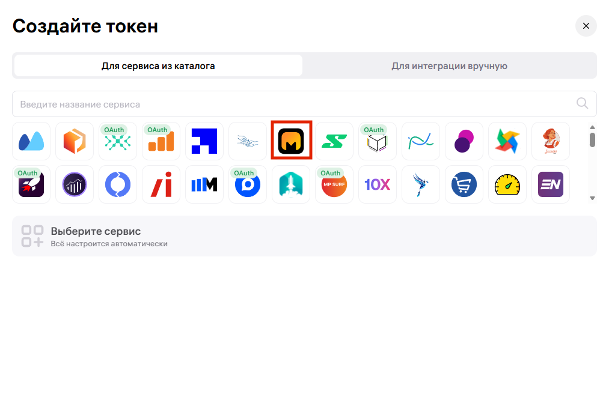
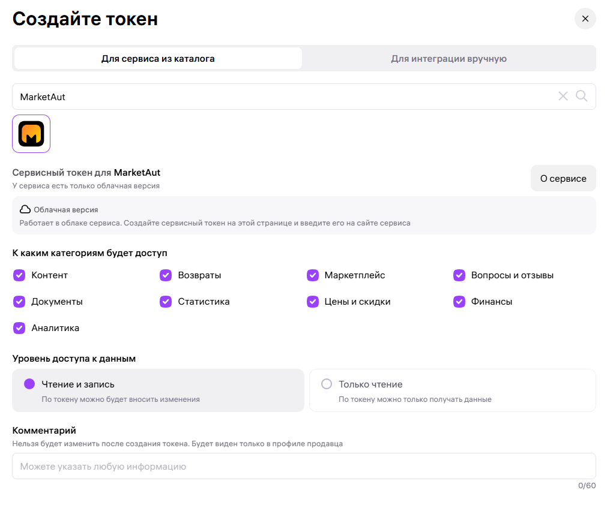

# Получение API-токена Wildberries

Любая интеграция с Wildberries начинается с создания API-токена. Он позволяет MarketAut получать данные из личного кабинета продавца и выполнять действия от его имени в рамках предоставленных разрешений.

⚠️ Создать API-токен может только владелец личного кабинета Wildberries.

Откройте [Портал продавца Wildberries](https://seller.wildberries.ru/) и войдите в личный кабинет.

В левом меню откройте раздел **«Настройки»**, затем выберите **«Интеграции по API»**.


Нажмите кнопку **«Создать токен»**.

Если API-токены уже создавались ранее, они будут отображаться на этой же странице.


## Выбор способа создания токена

Создать токен для MarketAut можно тремя способами. Независимо от выбранного способа, пользователь должен быть владельцем личного кабинета Wildberries.

### 1. По прямой ссылке

Перейдите по [прямой ссылке на MarketAut в каталоге Wildberries](https://seller.wildberries.ru/api-integrations?id=MA6tMAYrRR6ZBG6-AhNO-Q).

MarketAut откроется автоматически. Проверьте выбранные категории доступа и продолжите создание токена.

### 2. Через поиск в каталоге

В окне создания токена откройте вкладку «Для сервиса из каталога».

В поле «Введите название сервиса» начните вводить `MarketAut`, затем выберите сервис с логотипом MarketAut.




После выбора сервиса категории доступа отметятся автоматически. При необходимости ненужные категории можно отключить вручную.

### 3. Для интеграции вручную

Старый способ создания токена продолжает работать.

Откройте вкладку «Для интеграции вручную» и выберите «Базовый токен».

Этот тип токена подходит для подключения MarketAut.

⚠️ Передавайте API-токен только тем сервисам, которым доверяете. Он предоставляет доступ к данным личного кабинета в пределах выбранных разрешений.

> MarketAut входит в список проверенных сервисов Wildberries
>
> [Проверить MarketAut на сайте Wildberries →](https://seller.wildberries.ru/auth-services?id=marketaut.ru)


## Название токена

В поле **«Придумайте название токена»** укажите любое удобное название.

Например:

```text
MarketAut
```

Название используется только для удобства и помогает понять, для какого сервиса был создан токен.

## Категории доступа

Набор категорий зависит от способа создания токена.

### При создании токена через каталог

После выбора MarketAut необходимые категории доступа отмечаются автоматически.

Если вы планируете использовать все возможности MarketAut, оставьте выбранные категории без изменений. Ненужные категории можно отключить вручную, но связанные с ними инструменты MarketAut будут недоступны.

### При создании токена вручную

Для работы основных функций MarketAut отметьте как минимум следующие категории:

- **Контент**;
- **Вопросы и отзывы**;
- **Чат с покупателем**.

Дополнительные категории, такие как «Возвраты», «Маркетплейс», «Документы», «Статистика», «Цены и скидки», «Финансы» и «Аналитика», выбираются в зависимости от инструментов MarketAut, которые вы планируете использовать.

| Категория | Для чего используется |
| --- | --- |
| Контент | Работа с карточками товаров, характеристиками и фотографиями |
| Вопросы и отзывы | Просмотр вопросов и отзывов покупателей, а также отправка ответов |
| Чат с покупателем | Получение и отправка сообщений покупателям |

## Уровень доступа

Для выбранных категорий установите уровень доступа **«Чтение и запись»**.

Такой уровень позволяет MarketAut:

- отвечать на отзывы и вопросы;
- отправлять сообщения покупателям;
- изменять данные карточек товара;
- загружать фотографии;
- выполнять другие доступные действия через API Wildberries.

Если выбрать вариант **«Только чтение»**, MarketAut сможет получать информацию, но не сможет вносить изменения.

## Создание и копирование токена

Проверьте выбранные параметры и нажмите кнопку **«Создать токен»**.

После создания нажмите **«Скопировать»**.

⚠️ После закрытия окна повторно посмотреть полный API-токен невозможно. Если токен не был сохранён, потребуется создать новый.

Не публикуйте API-токен в открытом доступе и не передавайте его третьим лицам.

## Добавление токена в MarketAut

Вернитесь в MarketAut и откройте настройки аккаунта Wildberries.

Вставьте скопированный API-токен в соответствующее поле и сохраните изменения.

После сохранения система проверит токен и подключит аккаунт Wildberries.

✅ После успешного подключения можно использовать инструменты MarketAut для работы с магазином Wildberries.