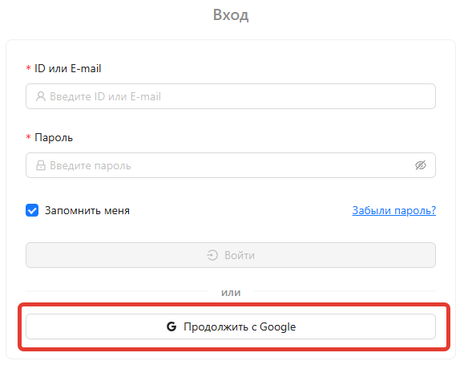

# Регистрация

В настоящее время доступен следующий способ регистрации:

- Учетная запись Google

Для регистрации:

1) Перейдите на [Главную страницу](https://marketaut.ru)
2) Нажмите **Продолжить с Google**

3) Выберите учетную запись Google или выполните вход в неё.
4) После успешной авторизации будет создана ваша учетная запись MarketAut.

# Вход

Если вы уже зарегистрированы, вход на платформу выполняется автоматически при посещении сайта.

Если автоматический вход не произошёл (например, при входе с нового устройства или после выхода из аккаунта), выполните действия из раздела **Регистрация**. Процесс входа полностью совпадает с процессом регистрации через Google.