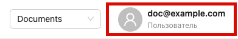
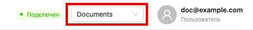

# Marketaut

**MarketAut** — это платформа для подключения ИИ-инструментов и автоматизации рабочих процессов.

Основные сущности, используемые на платформе:

- Пользователь
- Команда
- Диаграмма
- Аккаунт
- [ИИ-агент](../5-claude/01-claude-connect.md)

## Пользователь

**Пользователь** — это зарегистрированный участник платформы. 

Пользователь может входить в одну или несколько команд и работать с общими диаграммами и аккаунтами каждой из них.

Информация о пользователе отображается в правом верхнем углу экрана:

При нажатии на профиль пользователя открывается меню:

В меню можно:
1. Изменить настройки пользователя
2. Создать персональный токен
3. Выйти из платформы
4. Изменить язык интерфейса 
5. Добавить еще один аккаунт 

## Команда

**Команда** —  это общее рабочее пространство, в котором пользователи совместно работают с диаграммами, аккаунтами и другими ресурсами. 

Все аккаунты, диаграммы и другие ресурсы создаются и хранятся в рамках команды и доступны её участникам. Приглашенные пользователи получают доступ ко всем ресурсам команды.

Все участники команды работают с одними и теми же ресурсами, поэтому нет необходимости передавать файлы или дублировать настройки.

При регистрации для пользователя автоматически создаётся новая команда.

Текущая команда отображается в правой верхней части экрана:

Если вы состоите в нескольких командах, переключаться между ними можно через этот список.
## Диаграмма

**Диаграмма** —  это визуальная схема автоматизации. На её холсте вы размещаете узлы и соединяете их между собой, формируя необходимую логику работы.

Одна диаграмма — одна автоматизация. Например, диаграмма может описывать подключение магазина Wildberries к  МСР-серверу.

Все диаграммы хранятся в команде и доступны её участникам.

Подробнее о диаграммах см. в разделе [Диаграммы](03-diagrams.md).

## Аккаунт

**Аккаунт** —  это сохранённые учётные данные для подключения к внешнему сервису. Например, API-токен Wildberries или логин и пароль другого сервиса.

Аккаунт настраивается один раз, после чего может использоваться в любых модулях, которым требуется доступ к соответствующему сервису. Это позволяет не вводить один и те же данные повторно в каждом модуле.

Все аккаунты хранятся в команде и доступны её участникам. 

Подробнее об аккаунтах см. в разделе [Аккаунты](01-accounts.md).
