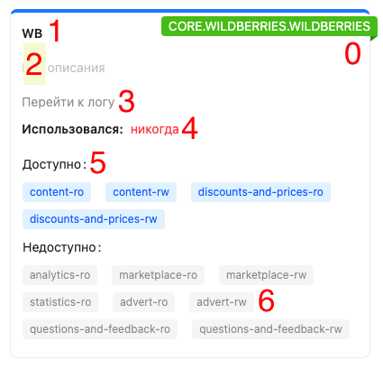
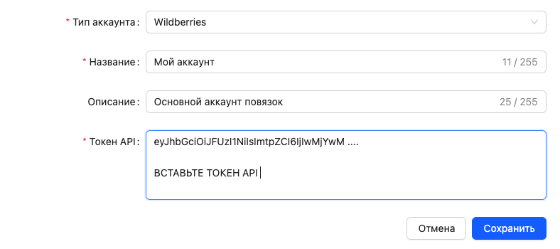
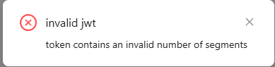

# Аккаунты

**Аккаунт** —  это сохранённые учётные данные для подключения к внешним сервисам. Например, API-токен Wildberries или логин и пароль для другого сервиса.

Аккаунт настраивается один раз, после чего может использоваться в любых узлах, которым требуется доступ к соответствующему сервису. Это позволяет не вводить одни и те же данные повторно в каждом модуле.

Все аккаунты хранятся в команде и доступны её участникам.

# Управление

Для управления аккаунтами откройте раздел [Конфигурация → Аккаунты](https://marketaut.ru/app/config/accounts).

(1) Количество созданных аккаунтов и лимит аккаунтов;
(2) Кнопка создания нового аккаунта;
(3) Список созданных аккаунтов.

## Информация об аккаунте

(0) Тип аккаунта;
(1) Наименование аккаунта, указанное при его создании;
(2) Описание аккаунта;
(3) Кнопка перехода к  журналу событий  аккаунта;
(4) Сведения о последнем использовании аккаунта;
(5) Доступные разделы;
(6) Недоступные разделы.

<h5 id="ref_account_create"></h5>
## Создание аккаунта

1. Перейдите в раздел  [Конфигурация → Аккаунты](https://marketaut.ru/app/config/accounts);
2. Нажмите кнопку **+ Создать аккаунт;**
3. Выберите нужный **Тип аккаунта**;
Тип аккаунта определяет внешний сервис, для которого будут храниться учётные данные. Подробнее о типах аккаунтов см. в разделе [Типы аккаунтов](02-account-types.md).
4. Заполните поля:
    1. **Название** —  обязательное поле. Можно указать любое удобное название аккаунта.
    2. **Описание** — необязательное поле. Можно указать любое описание аккаунта.
    3. **Остальные поля** — зависят от выбранного типа аккаунта.
5. Нажмите кнопку **Сохранить**.

<h5 id="ref_account_edit"></h5>
## Редактирование аккаунта

1. Перейдите в раздел [Конфигурация → Аккаунты](https://marketaut.ru/app/config/accounts);
2. Выберите ранее созданный аккаунт и нажмите на него. Откроется окно управления аккаунтом;
3. Поля, доступные для редактирования, отмечены значком карандаша;
4. Нажмите на него, введите новое значение и нажмите **ВВОД** для сохранения.

## Удаление аккаунта

1. Перейдите в раздел  [Конфигурация → Аккаунты](https://marketaut.ru/app/config/accounts);
2. Выберите аккаунт, который необходимо удалить. Откроется окно редактирования аккаунта;
3. Нажмите  кнопку удаления (значок корзины);
4. Подтвердите удаление аккаунта.

# FAQ

##  ⚠️ Не создаётся аккаунт: `invalid jwt`

Ошибка возникает, если API-токен был введён некорректно. Проверьте, что API-токен полностью скопирован из личного кабинета Wildberries и вставлен без изменений.
