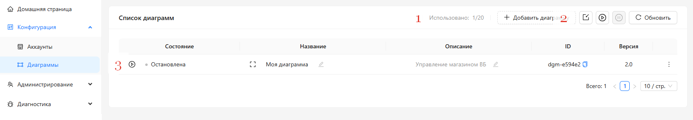
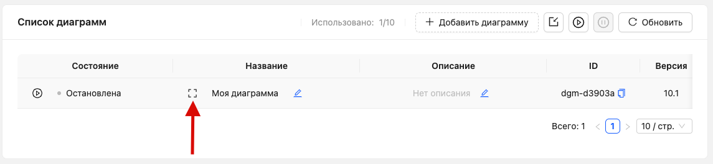
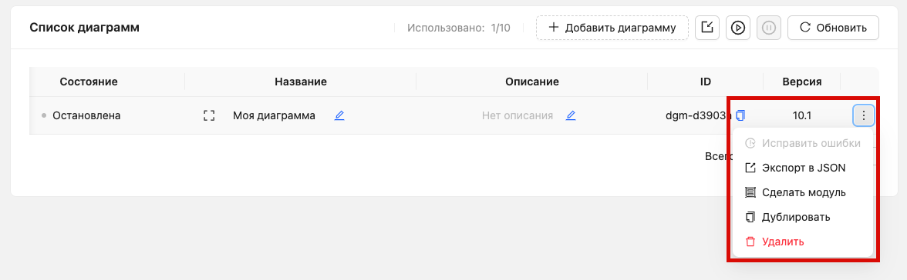

# Диаграммы

**Диаграмма** — это визуальная схема автоматизации. На её холсте вы размещаете узлы и соединяете их между собой формируя, необходимую логику работы.

Одна диаграмма — одна автоматизация. Например, диаграмма может описывать подключение вашего магазина Wildberries к MCP-серверу.

Все диаграммы хранятся в команде и доступны её участникам.

# Управление

Для управления диаграммами откройте раздел [Конфигурация → Диаграммы](https://marketaut.ru/app/config/diagrams)

(1) Количество созданных диаграмм и доступный лимит;
(2) Кнопка создания новой диаграммы;
(3) Список созданных диаграмм.

<h5 id="ref_diagram_create"></h5>
## Создание диаграммы

1. Перейдите в раздел [Конфигурация → Диаграммы](https://marketaut.ru/app/config/diagrams);
2. Нажмите кнопку **+ Добавить диаграмму**;
3. Заполните поля:
    1. **Название** — обязательное поле. Укажите любое удобное название диаграммы.
    2. **Описание** — необязательное поле. При необходимости добавьте описание диаграммы.
4. Нажмите **Сохранить**.

Перед вами откроется пустой холст диаграммы.

Подробнее о настройке диаграмм см. в разделе [Настройка диаграмм](04-diagrams-edit.md)
<h5 id="ref_diagram_open"></h5>
## Открытие диаграммы

1. Перейдите в раздел [Конфигурация → Диаграммы](https://marketaut.ru/app/config/diagrams);
2. В строке с нужной диаграммой нажмите кнопку **Открыть**.

Подробнее о настройке диаграмм см. в разделе [Настройка диаграмм](04-diagrams-edit.md).

## Удаление диаграммы

1. Перейдите в раздел [Конфигурация → Диаграммы](https://marketaut.ru/app/config/diagrams);
2. Напротив нужной диаграммы нажмите кнопку меню;
3. В открывшемся меню выберите **Удалить**;
4. Подтвердите удаление диаграммы.

<h5 id="ref_diagram_start_stop"></h5>
## Запуск и остановка диаграммы

Диаграмма может находиться в одном из двух состояний.

**Запущено** — все процессы, настроенные на диаграмме, работают.
**Остановлено** — диаграмма доступна для редактирования, а связанные с ней процессы не выполняются.

После создания любая диаграмма находится в состоянии **остановлено** до тех пор, пока не будет настроена и запущена вручную.

При изменении настроек диаграмма автоматически **останавливается**. После завершения настройки её необходимо снова **запустить**.

Запустить диаграмму можно двумя способами: из общего списка диаграмм или из окна настройки диаграммы.

**Из списка диаграмм**
1. Перейдите в раздел  [Конфигурация → Диаграммы](https://marketaut.ru/app/config/diagrams);
2. Напротив нужной диаграммы нажмите кнопку запуска (3).

**Из окна настройки диаграммы**
1. Перейдите в раздел [Конфигурация → Диаграммы](https://marketaut.ru/app/config/diagrams);
2. Откройте нужную диаграмму;
3. В окне настройки диаграммы нажмите кнопку **Запустить**.

Подробнее о настройке диаграмм см. в разделе [Настройка диаграмм](04-diagrams-edit.md).