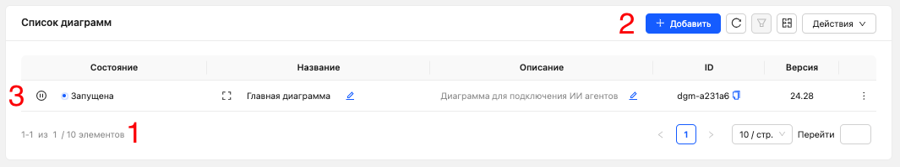
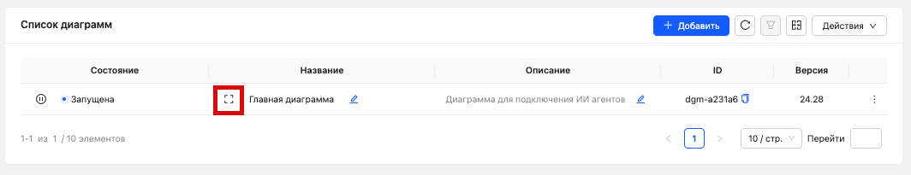
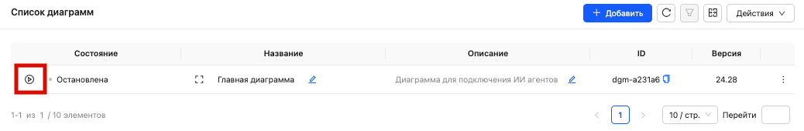
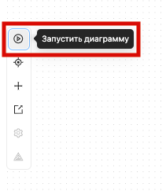
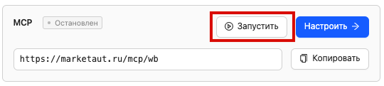
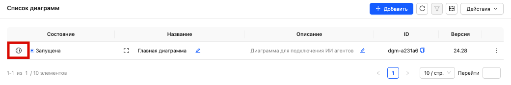
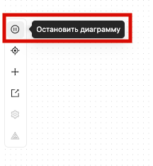
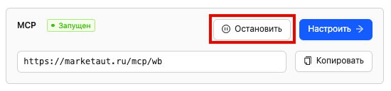
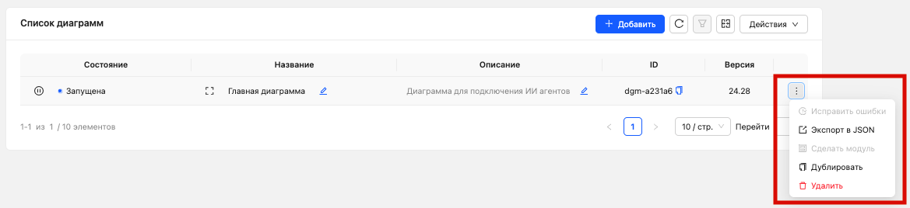

# Диаграммы

**Диаграмма** — это визуальная схема автоматизации. На её холсте вы размещаете узлы и соединяете их между собой формируя, необходимую логику работы.

Одна диаграмма — одна автоматизация. Например, диаграмма может описывать подключение вашего магазина Wildberries к MCP-серверу.

Все диаграммы хранятся в команде и доступны её участникам.

# Управление

Для управления диаграммами откройте раздел [Конфигурация → Диаграммы](https://marketaut.ru/app/config/diagrams)

(1) Количество диаграмм в списке и число элементов на странице;
(2) Кнопка создания новой диаграммы;
(3) Список созданных диаграмм.

<h5 id="ref_diagram_create"></h5>
## Создание диаграммы

1. Перейдите в раздел [Конфигурация → Диаграммы](https://marketaut.ru/app/config/diagrams);
2. Нажмите кнопку **+ Добавить диаграмму**;
3. Заполните поля:
    1. **Название** — обязательное поле. Укажите любое удобное название диаграммы;
    2. **Описание** — необязательное поле. При необходимости добавьте описание диаграммы;
4. Нажмите **Сохранить**.

Перед вами откроется пустой холст диаграммы.

Подробнее о настройке диаграмм см. в разделе [Настройка диаграмм](04-diagrams-edit.md)
<h5 id="ref_diagram_open"></h5>
## Открытие диаграммы

1. Перейдите в раздел [Конфигурация → Диаграммы](https://marketaut.ru/app/config/diagrams);
2. В строке с нужной диаграммой нажмите кнопку **Открыть**.

Подробнее о настройке диаграмм см. в разделе [Настройка диаграмм](04-diagrams-edit.md).
## Запуск диаграммы

Запустить диаграмму можно тремя способами.

**Из списка диаграмм**
1. Перейдите в раздел  [Конфигурация → Диаграммы](https://marketaut.ru/app/config/diagrams);
2. Напротив нужной диаграммы нажмите кнопку запуска.

**Из окна настройки диаграммы**
1. Перейдите в раздел [Конфигурация → Диаграммы](https://marketaut.ru/app/config/diagrams);
2. Откройте нужную диаграмму;
3. В окне настройки диаграммы нажмите кнопку **Запустить**.

**С домашней страницы**
1. Перейдите на домашнюю страницу;
2. В блоке **«Подключите вашего агента»** нажмите **Запустить**.

После запуска статус диаграммы изменится на **«Запущена»**, а настроенные процессы начнут работать.

## Остановка диаграммы 

Остановить диаграмму можно тремя способами.

**Из списка диаграмм**
1. Перейдите в раздел  [Конфигурация → Диаграммы](https://marketaut.ru/app/config/diagrams);
2. Напротив нужной диаграммы нажмите кнопку остановки.

**Из окна настройки диаграммы**
1. Перейдите в раздел [Конфигурация → Диаграммы](https://marketaut.ru/app/config/diagrams);
2. Откройте нужную диаграмму;
3. В окне настройки диаграммы нажмите кнопку **Остановить**.

**С домашней страницы**
1. Перейдите на домашнюю страницу;
2. В блоке **«Подключите вашего агента»** нажмите **Остановить**.

После остановки статус изменится на **«Остановлена»**, а связанные с диаграммой процессы перестанут выполняться.

При изменении настроек запущенная диаграмма останавливается автоматически. После завершения настройки её необходимо запустить снова.

## Получение диаграммы по QR-коду

Готовую диаграмму можно получить с помощью QR-кода, предоставленного специалистом MarketAut.

⚠️**Важно:** если специалист внесёт изменения в исходную диаграмму, они автоматически появятся и в подключённой диаграмме. Повторно сканировать QR-код не потребуется.

1. Откройте камеру или приложение для сканирования QR-кодов; 
2. Наведите камеру на полученный QR-код; 
3. Перейдите по появившейся ссылке;
4. После сканирования диаграмма появится в вашем рабочем пространстве. 

## Удаление диаграммы 

⚠️ **Важно:** после удаления диаграммы настроенные в ней процессы перестанут работать, а подключение к ИИ через эту диаграмму станет недоступно.

Перед удалением убедитесь, что диаграмма больше не используется.

1. Напротив нужной диаграммы нажмите кнопку меню;
2. В открывшемся меню выберите **Удалить**;
3. Подтвердите удаление диаграммы.

<h5 id="ref_diagram_start_stop"></h5>

Подробнее о настройке диаграмм см. в разделе [Настройка диаграмм](04-diagrams-edit.md).