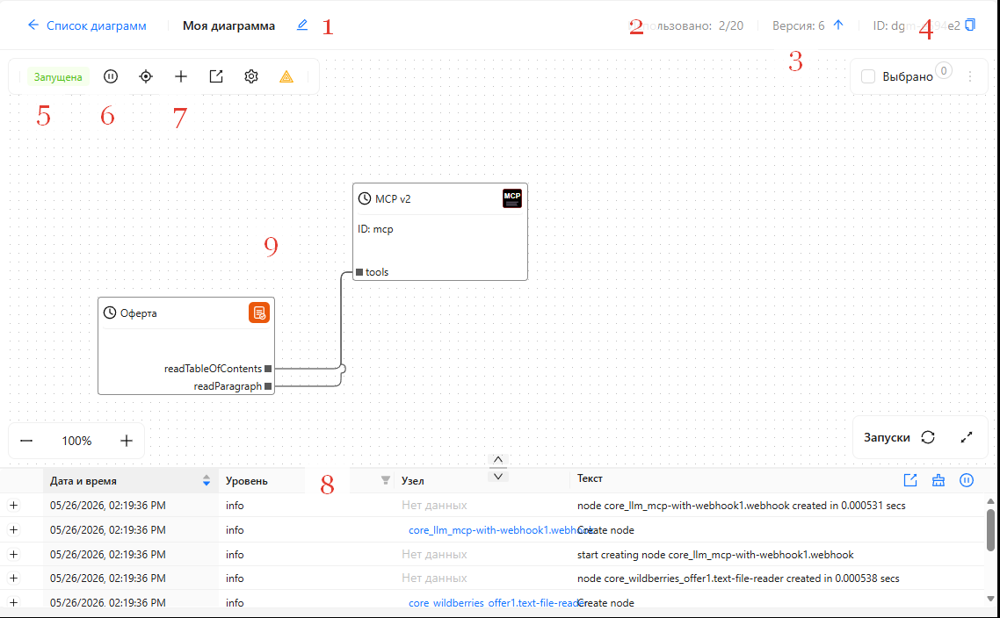
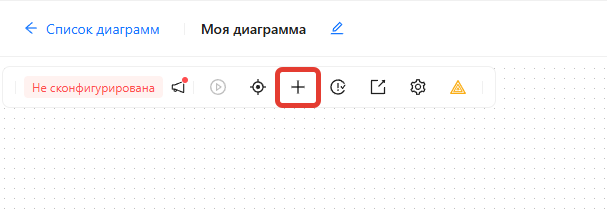
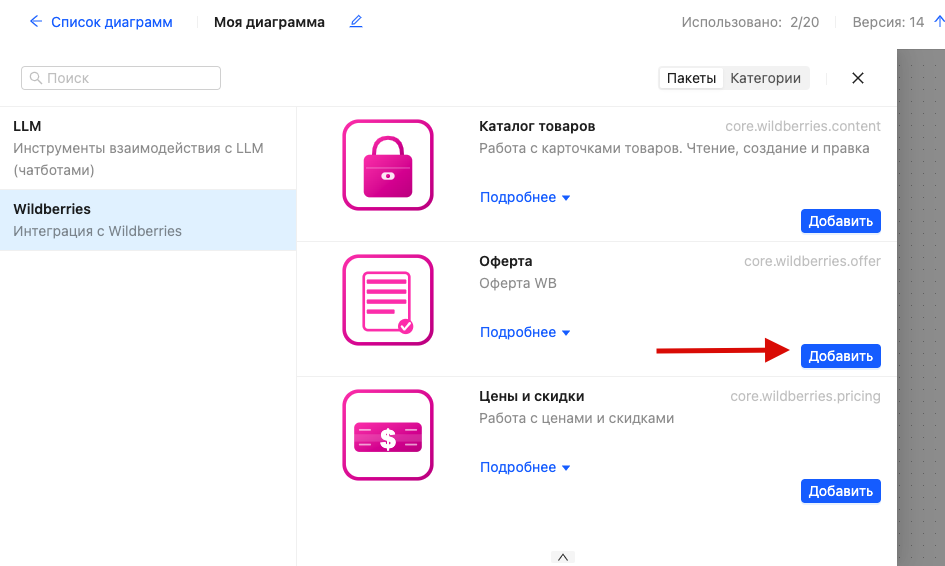
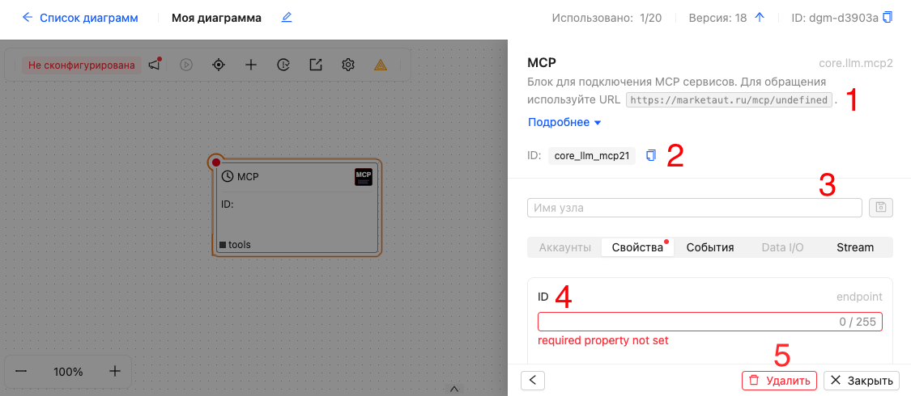
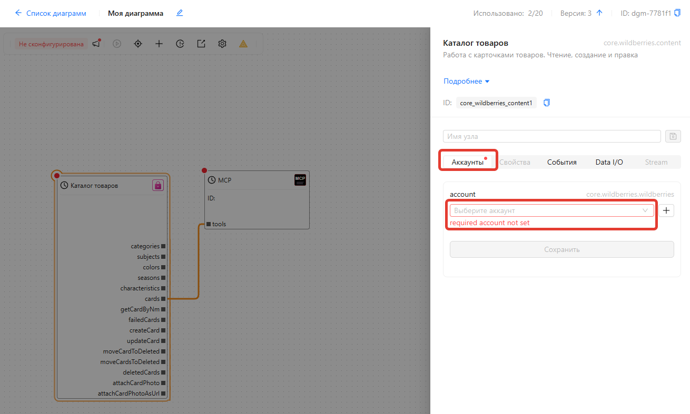
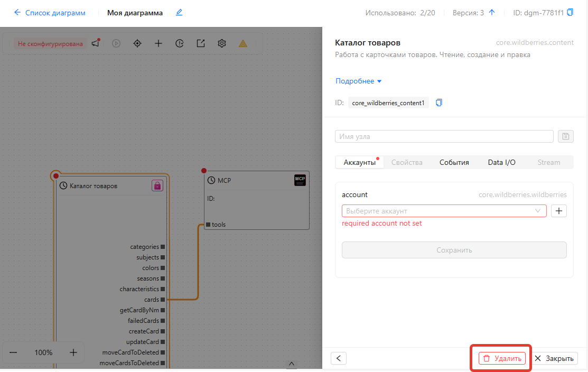
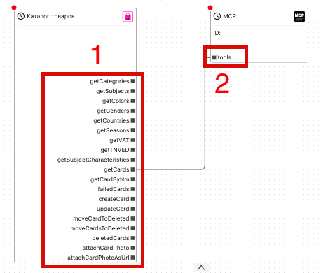
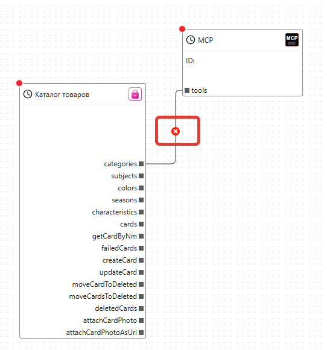

# Настройка диаграммы

Для настройки диаграммы выполните следующие действия:

1. Перейдите в раздел [Конфигурация → Диаграммы](https://marketaut.ru/app/config/diagrams)
2. Откройте нужную диаграмму 

**Элементы холста настройки диаграммы**

(1) Наименование диаграммы и кнопка его редактирования.
(2) Количество созданных диаграмм и доступный лимит.
(3) Версия диаграммы.
(4) Идентификатор (ID) диаграммы.
(5) Текущее состояние диаграммы.
(6) Кнопка запуска и остановки диаграммы.
(7) Кнопка добавления нового узла на диаграмму.
(8) Область журнала событий, связанных с диаграммой.
(9) Холст диаграммы с размещёнными на нём узлами и связями.

## Добавление узла

Для добавления нового узла:
1. Нажмите на кнопку **(+)** в верхней части диаграммы

2. В открывшемся списке выберите **Нужный тип узла**.
3. В группе выберите тип узла и нажмите **Добавить**

## Редактирование узла

Для редактирования узла:
1. Выберите нужный узел на диаграмме. 
2. В правой части экрана откроется панель свойств узла.
3. Введите необходимые параметры.

(1) Описание узла.
(2) Уникальный идентификатор (ID) узла.
(3) Имя узла.
(4) Область настройки свойств узла.
(5) Кнопки удаления узла и закрытия панели свойств.

Для изменения свойств узла перейдите на вкладку **Свойства**, внесите необходимые изменения и нажмите **Сохранить**

## Привязка узла к аккаунту

Многие узлы требуют привязки к аккаунту. Например, узлы для работы с карточками товаров Wildberries необходимо привязать к аккаунту, чтобы они работали с нужным магазином.

Для каждого магазина Wildberries можно создать отдельный аккаунт и привязать к нему необходимые узлы. Это позволяет работать с несколькими магазинами одновременно. Например, можно настроить автоматическое копирование карточек товаров из одного магазина в другой.

Для привязки узла к аккаунту:
1. Выберите нужный узел на диаграмме. 
2. В правой части экрана откроется панель свойств узла.
3. Перейдите на вкладку **Аккаунты**.
4. В выпадающем списке выберите нужный аккаунт.

Обратите внимание: аккаунт должен быть создан заранее. 
Подробнее о создании аккаунтов см. в разделе [Аккаунты](01-accounts.md)

## Удаление узла

Для удаления узла:
1. Выберите нужный узел на диаграмме. 
2. В правой части экрана откроется панель свойств узла.
3. Нажмите кнопку **Удалить**.

## Соединение и разъединение узлов

Соединение узлов определяет логику работы диаграммы.

Например, узел **MCP** предоставляет ИИ доступ ко всем инструментам,**подключённым** к его входу **`tools`**. 

Благодаря этому можно создавать ИИ-агентов с необходимым набором инструментов и предоставлять доступ только к тем из них, которые нужны для решения конкретной задачи.

Соединять можно только **выходы** со **входами**. Выходы (1) расположены на правой стороне узла, а входы (2) — на левой.

Для создания связи нажмите на выход одного узла и, удерживая кнопку мыши, перетащите соединение на вход другого узла.

Для **удаления** связи:
1. Выберите связь, которую необходимо удалить, щелкнув на ней мышью.
2. Нажмите на появившийся значок крестика.

