# Настройка диаграммы

Для настройки диаграммы выполните следующие действия:

1. Перейдите в раздел [Конфигурация → Диаграммы](https://marketaut.ru/app/config/diagrams);
2. Откройте нужную диаграмму.

**Элементы холста настройки диаграммы**

(1) Название диаграммы и кнопка редактирования;  
(2) Текущее состояние диаграммы;  
(3) Количество используемых узлов и доступный лимит;  
(4) Версия диаграммы;  
(5) Идентификатор (ID) диаграммы;  
(6) Панель инструментов;  
(7) Холст с размещёнными на нём узлами, группами и связями;  
(8) Элементы управления масштабом;  
(9) Журнал событий.

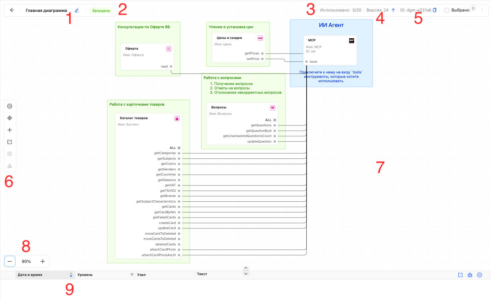
## Добавление узла

Для добавления нового узла:
1. Нажмите кнопку **«+»** на левой панели инструментов;
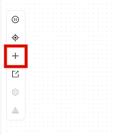
2. В открывшемся панели выберите нужную группу узлов;
3. Найдите нужный узел и нажмите **Добавить**.
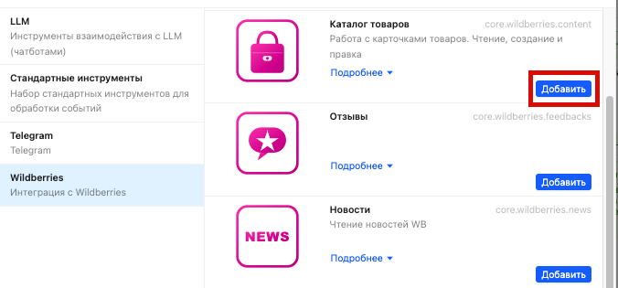

## Редактирование узла

Для редактирования узла:
1. Выберите нужный узел на диаграмме;
2. В правой части экрана откроется панель свойств узла;
3. Введите необходимые параметры.

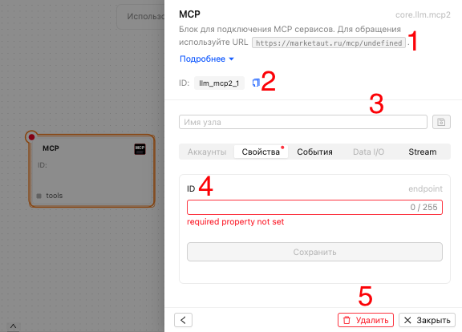
(1) Описание узла;
(2) Уникальный идентификатор (ID) узла;
(3) Имя узла;
(4) Область настройки свойств узла;
(5) Кнопки удаления узла и закрытия панели свойств.

Для изменения свойств узла перейдите на вкладку **Свойства**, внесите необходимые изменения и нажмите **Сохранить**.
### Индикатор незаполненных параметров

Красная точка рядом с узлом означает, что его настройка не завершена и обязательные параметры не заполнены.

Необходимо заполнить параметры:
- для узла MCP требуется указать **ID** во вкладке **Свойства**;
- для узлов Wildberries требуется выбрать аккаунт во вкладке **Аккаунты**.
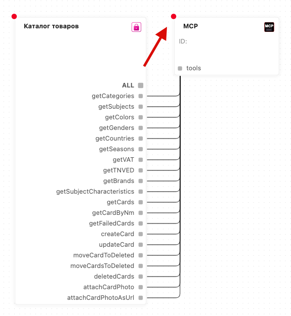
После заполнения и сохранения обязательных параметров красная точка исчезнет.
## Адрес подключения MCP

Адрес подключения формируется автоматически на основе значения, указанного в поле **ID** во вкладке **Свойства** узла MCP.

Например, если в поле **ID** указано значение `wb`, адрес будет выглядеть так:

`https://marketaut.ru/mcp/wb`

Для формирования адреса используется значение из поля **ID** во вкладке **Свойства**, а не уникальный идентификатор узла, отображаемый в верхней части панели.

Пока поле **ID** не заполнено, в адресе может отображаться значение `undefined`.

Готовый адрес можно посмотреть в двух местах:

1. В описании узла MCP на панели его свойств;
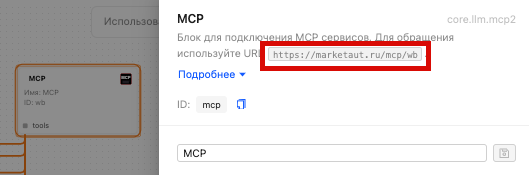
2. На домашней странице MarketAut в блоке **«Подключите вашего агента»**.
 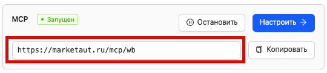
На домашней странице нажмите **Копировать**, чтобы сохранить адрес в буфер обмена.

Если изменить значение **ID**, адрес подключения также изменится. После этого новый адрес необходимо указать в подключённом ИИ-сервисе.
## Привязка узла к аккаунту

Многие узлы требуют привязки к аккаунту. Например, узлы для работы с карточками товаров Wildberries необходимо привязать к аккаунту, чтобы они работали с нужным магазином.

Для каждого магазина Wildberries можно создать отдельный аккаунт и привязать к нему необходимые узлы. Это позволяет работать с несколькими магазинами одновременно. Например, можно настроить автоматическое копирование карточек товаров из одного магазина в другой.

Для привязки узла к аккаунту:
1. Выберите нужный узел на диаграмме;
2. В правой части экрана откроется панель свойств узла;
3. Перейдите на вкладку **Аккаунты**;
4. В выпадающем списке выберите нужный аккаунт.
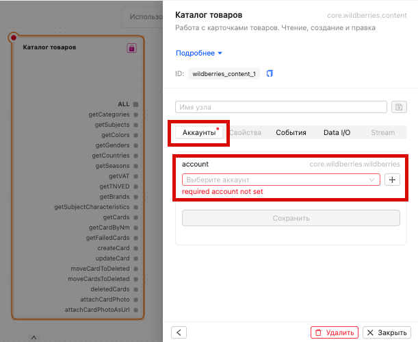

⚠️ **ВАЖНО:** аккаунт необходимо создать до привязки узла.

Подробнее о создании аккаунтов см. в разделе [Аккаунты](01-accounts.md).

## Соединение узлов

Соединение узлов определяет логику работы диаграммы.

Например, узел **MCP** предоставляет ИИ доступ ко всем инструментам, **подключённым** к его входу **`tools`**. 

Благодаря этому можно создавать ИИ-агентов с необходимым набором инструментов и предоставлять доступ только к тем из них, которые нужны для решения конкретной задачи.

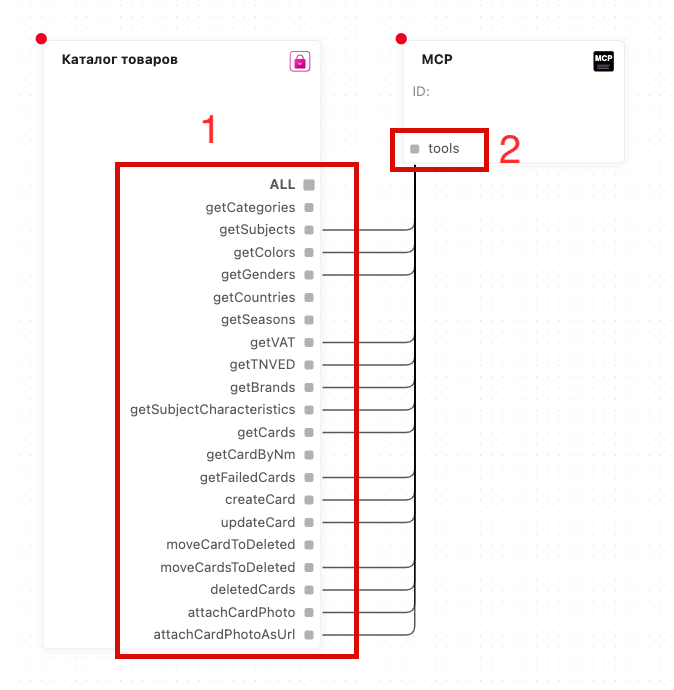

Соединять можно только **выходы** со **входами**. Выходы (1) расположены на правой стороне узла, а входы (2) — на левой.

Для создания связи нажмите на выход одного узла и, удерживая кнопку мыши, перетащите соединение на вход другого узла.

## Подключение всех инструментов через `ALL`

Узел может содержать несколько инструментов. Если ИИ-агенту необходимо предоставить доступ ко всем инструментам узла, используйте выход `ALL`. Это позволяет не подключать каждый выход по отдельности.

Для подключения всех инструментов:

1. Нажмите на выход рядом с `ALL`;
2. Удерживая кнопку мыши, протяните связь ко входу `tools` узла MCP;
3. Отпустите кнопку мыши.

После этого все доступные инструменты узла будут подключены к MCP.

Если ИИ-агенту нужны только отдельные инструменты, соедините с `tools` соответствующие выходы по одному.
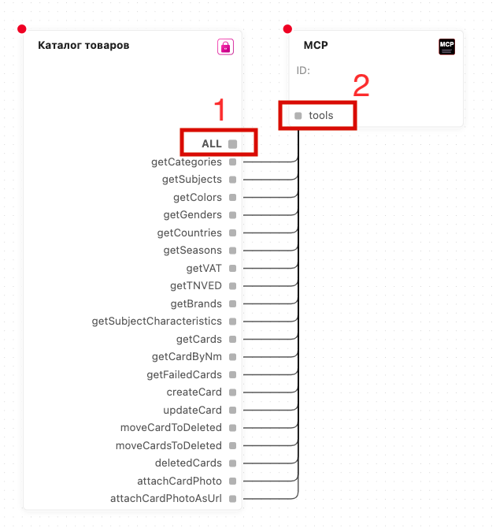
(1) Выход `ALL`;  
(2) Вход `tools` узла MCP.

## Разъединение узлов

Для удаления связи:

1. Выберите связь, которую необходимо удалить, щелкнув на ней мышью;
2. Нажмите на появившийся значок крестика;
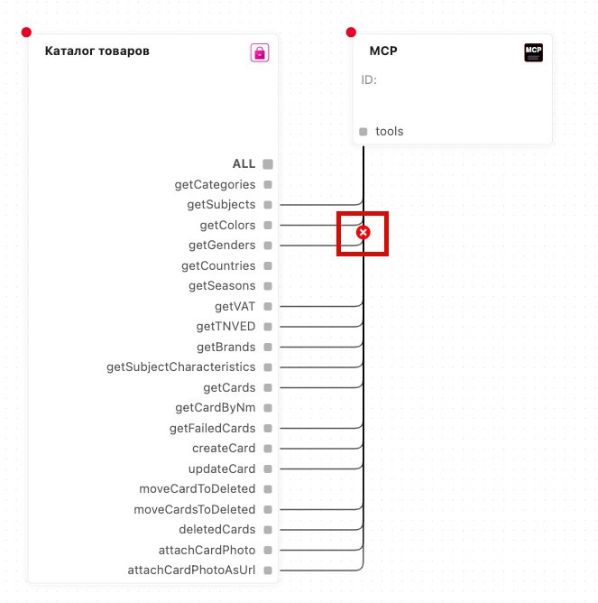

## Удаление узла

⚠️ **ВАЖНО:** после удаления узла связанные с ним соединения также будут удалены, а выполняемые им функции станут недоступны.

Перед удалением убедитесь, что узел больше не используется в диаграмме.

Для удаления узла:
1. Выберите нужный узел на диаграмме;
2. В правой части экрана откроется панель свойств узла;
3. Нажмите кнопку **Удалить**.

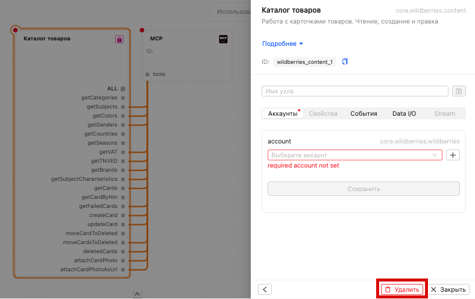