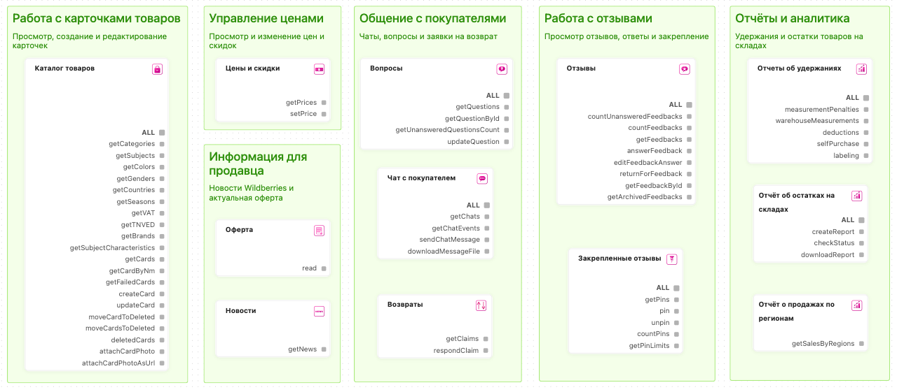

# Инструменты MarketAut

MarketAut предоставляет инструменты для работы с магазином Wildberries через ChatGPT и Claude.

Инструменты добавляются в диаграмму в виде узлов. Можно подключить всю группу с помощью пункта **ALL** или выбрать только отдельные функции.

О новых инструментах и обновлениях MarketAut сообщаем в [Telegram-канале](https://t.me/marketaut1).

Все доступные инструменты разделены по направлениям:

- Контент
- Цены
- FBS
- Коммуникации
- Отчёты
- Информация
- Интеграции

## Контент

### Каталог товаров

| Инструмент | Описание |
| --- | --- |
| `catalogue` | Получает данные каталога товаров |
| `delete` | Удаляет карточку товара |
| `getCards` | Получает список карточек товаров |
| `getCardByNm` | Получает карточку товара по артикулу WB |
| `getFailedCards` | Получает список карточек с ошибками |
| `createCard` | Создаёт карточку товара |
| `updateCard` | Обновляет карточку товара |
| `attachCardPhoto` | Добавляет фотографию в карточку товара |
| `attachCardPhotoAsUrl` | Добавляет фотографию в карточку товара по ссылке |

## Цены

### Цены и скидки

| Инструмент  | Описание                                     |
| ----------- | -------------------------------------------- |
| `getPrices` | Получает текущие цены и скидки на товары     |
| `setPrice`  | Устанавливает новую цену или скидку на товар |

## FBS

### Заказы и поставки

| Инструмент                         | Описание                                             |
| ---------------------------------- | ---------------------------------------------------- |
| `getNewOrders`                     | Получает список новых сборочных заданий              |
| `getOrdersByPeriod`                | Получает сборочные задания за выбранный период       |
| `getOrdersStatuses`                | Получает статусы сборочных заданий                   |
| `getReshipmentOrders`              | Получает сборочные задания для повторной отгрузки    |
| `cancelOrder`                      | Отменяет сборочное задание                           |
| `getOrderStickers`                 | Получает стикеры сборочных заданий                   |
| `getCrossBorderOrderStickers`      | Получает стикеры трансграничных заказов              |
| `getCrossBorderOrderStatusHistory` | Получает историю статусов трансграничных заказов     |
| `getOrderClientInfo`               | Получает информацию о получателе заказа              |
| `getArchiveOrders`                 | Получает архив сборочных заданий                     |
| `createSupply`                     | Создаёт новую поставку                               |
| `getSupplies`                      | Получает список поставок                             |
| `addOrdersToSupply`                | Добавляет сборочные задания в поставку               |
| `getSupplyDetails`                 | Получает информацию о поставке                       |
| `deleteSupply`                     | Удаляет поставку                                     |
| `getSupplyOrderIds`                | Получает идентификаторы сборочных заданий в поставке |
| `moveSupplyToDelivery`             | Передаёт поставку в доставку                         |
| `getSupplyQRCode`                  | Получает QR-код поставки                             |
| `addShippingUnitsToSupply`         | Добавляет грузовые места в поставку                  |
| `getSupplyShippingUnits`           | Получает список грузовых мест поставки               |
| `deleteShippingUnitsFromSupply`    | Удаляет грузовые места из поставки                   |
| `getSupplyShippingUnitQRCodes`     | Получает QR-коды грузовых мест поставки              |

### Маркировка сборочных заданий

| Инструмент  | Описание                                    |
| ----------- | ------------------------------------------- |
| `labels`    | Закрепляет маркировку за сборочным заданием |
| `getLabels` | Получает маркировку сборочного задания      |

### Пропуска

| Инструмент | Описание |
|---|---|
| `getOfficesForPass` | Получает список складов для оформления пропуска |
| `getPasses` | Получает список пропусков |
| `createPass` | Создаёт пропуск |
| `updatePass` | Обновляет данные пропуска |
| `deletePass` | Удаляет пропуск |

## Коммуникации

### Отзывы

| Инструмент | Описание |
|---|---|
| `countUnansweredFeedbacks` | Получает количество неотвеченных отзывов |
| `countFeedbacks` | Получает общее количество отзывов |
| `getFeedbacks` | Получает список отзывов |
| `getFeedbackById` | Получает отзыв по его идентификатору |
| `answerFeedback` | Отправляет ответ на отзыв |
| `editFeedbackAnswer` | Редактирует ранее отправленный ответ |
| `returnForFeedback` | Оформляет возврат товара по идентификатору отзыва |
| `getArchivedFeedbacks` | Получает архивные отзывы |

### Закреплённые отзывы

| Инструмент | Описание |
|---|---|
| `getPins` | Получает список закреплённых отзывов |
| `pin` | Закрепляет отзыв |
| `unpin` | Снимает закрепление с отзыва |
| `countPins` | Получает количество закреплённых отзывов |
| `getPinLimits` | Получает доступные лимиты на закрепление отзывов |

### Вопросы

| Инструмент | Описание |
|---|---|
| `getQuestions` | Получает список вопросов покупателей |
| `getQuestionById` | Получает вопрос по его идентификатору |
| `getUnansweredQuestionsCount` | Получает количество неотвеченных вопросов |
| `updateQuestion` | Отправляет или редактирует ответ на вопрос |

### Чат с покупателем

| Инструмент | Описание |
|---|---|
| `getChats` | Получает список чатов с покупателями |
| `getChatEvents` | Получает сообщения и события из чатов |
| `sendChatMessage` | Отправляет сообщение покупателю |
| `downloadMessageFile` | Скачивает файл из сообщения |

### Возвраты

| Инструмент | Описание |
|---|---|
| `getClaims` | Получает заявки покупателей на возврат товаров |
| `respondClaim` | Отправляет решение по заявке на возврат |

## Отчёты

### Финансы: отчёты

| Инструмент | Описание |
|---|---|
| `getDetailsByPeriod` | Получает финансовый отчёт за выбранный период |

### Финансы: баланс

| Инструмент | Описание |
|---|---|
| `getBalance` | Получает текущий баланс продавца |

### Отчёт о платном хранении

| Инструмент | Описание                          |
| ---------- | --------------------------------- |
| `report`   | Получает отчёт о платном хранении |

### Отчёты об удержаниях

| Инструмент              | Описание                                                           |
| ----------------------- | ------------------------------------------------------------------ |
| `measurementPenalties`  | Получает отчёт об удержаниях за занижение габаритов упаковки       |
| `warehouseMeasurements` | Получает результаты замеров упаковки на складах Wildberries        |
| `deductions`            | Получает отчёт об удержаниях                                       |
| `selfPurchase`          | Получает отчёт об удержаниях за самовыкупы                         |
| `labeling`              | Получает отчёт об удержаниях за отсутствие обязательной маркировки |

### Отчёт о продажах по регионам

| Инструмент | Описание |
|---|---|
| `getSalesByRegions` | Получает отчёт о продажах товаров по регионам |

### Отчёт об остатках на складах

| Инструмент | Описание                                      |
| ---------- | --------------------------------------------- |
| `report`   | Получает отчёт об остатках товаров на складах |

### Лента заказов

| Инструмент  | Описание                       |
| ----------- | ------------------------------ |
| `getOrders` | Получает отчёт «Лента заказов» |

## Информация

### Новости

| Инструмент | Описание |
|---|---|
| `getNews` | Получает список новостей Wildberries |

### Оферта

| Инструмент | Описание |
|---|---|
| `read` | Получает текст оферты |

## Интеграции

### Telegram

| Инструмент     | Описание                        |
| -------------- | ------------------------------- |
| `sendMessage`  | Отправляет сообщение в Telegram |
| `downloadFile` | Скачивает файл из Telegram      |
