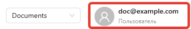
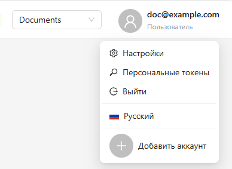

# Marketaut

**Marketaut** — это платформа для подключения ИИ-инструментов. 

Основные концепции, используемые на платформе:
- [Пользователь](#пользователь)
- [Команда](#команда)
- [Диаграмма](#диаграмма)
- [Аккаунт](#аккаунт)
- [ИИ агент](/5-claude/01-claude-connect)

## Пользователь

**Пользователь** — это учётная запись человека на платформе. 

Пользователь может состоять в одной или нескольких Командах, работая с общими диаграммами и аккаунтами каждой из них.

Текущий пользователь отображается в правом верхнем углу экрана:

При нажатии на Пользователя открывается его меню:

В меню можно:
1. Поменять настройки пользователя
2. Выписать себе персональный токен*
3. Выйти с платформы
4. Сменить язык
5. Добавить еще один аккаут в случае, если за одним рабочим местом работают несколько человек

## Команда
**Команда** - это общее рабочее пространство для нескольких пользователей.

Всё, что создаётся на платформе - аккаунты, диаграммы и другие ресурсы - хранится внутри **Команды** и доступно всем её участникам. Вы приглашаете нужных людей, и они сразу получают доступ к общим материалам.

Это удобно для совместной работы: не нужно передавать файлы или дублировать настройки - всё уже в одном месте.

Команда создается автоматически при регистрации нового пользователя.

Текущая команда отображается в правой верхней части экрана:

Если вы состоите в нескольких командах, их можно переключать через этот индикатор.

## Диаграмма

**Диаграммы** - визуальные схемы, на которых строится логика автоматизации. На ней вы размещаете модули на холсте и соединяете их визуально между собой, выстраивая нужную логику работы.

Одна диаграмма - одна автоматизация. Например, подключение вашего магазина Wildberries к MCP-серверу.

Все диаграммы хранятся внутри Команды и доступны её участникам.

Подробнее о диаграммах можно прочесть в разделе [Диаграммы](03-diagrams)

## Аккаунт

**Аккаунты** - это сохранённые учётные данные для подключения к внешнему сервису. Например, токен API от магазина Wildberries, логин и пароль от другого сервиса.

Вы настраиваете аккаунт один раз, а затем используете его в любых модулях, которым нужен доступ к этому сервису. Не нужно вводить одни и те же данные повторно в каждом модуле.

Все аккаунты хранятся внутри Команды и доступны её участникам

Подробнее об аккаунтах можно прочесть в разделе [Аккаунты](01-accounts)
