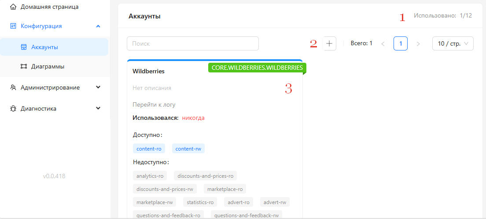
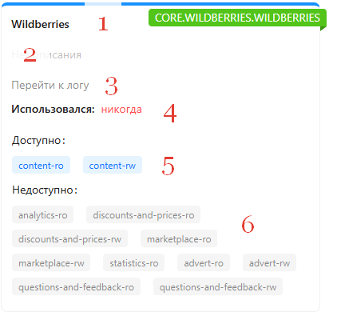
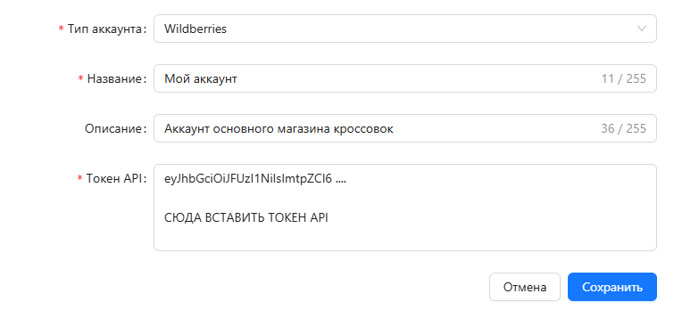
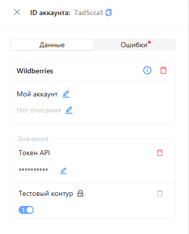
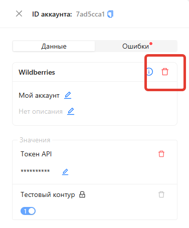

# Аккаунты

**Аккаунты** - это сохранённые учётные данные для подключения к внешним сервисам. Например, токен API от магазина Wildberries, логин и пароль от другого сервиса.

Вы настраиваете аккаунт один раз, а затем используете его в любых модулях, которым нужен доступ к этому сервису. Не нужно вводить одни и те же данные повторно в каждом модуле.

Все аккаунты хранятся внутри Команды и доступны её участникам.

# Управление

Управление Аккаунтами осуществляется в разделе [Конфигурация -> Аккаунты](https://web.marketaut.ru/app/config/accounts)

(1) Количество созданных / доступных аккаунтов. 
(2) Кнопка создания нового аккаунта
(3) Область отображения созданных ранее аккаунтов

## Информация об аккаунте

(0) Тип аккаунта
(1) Наименование аккаунта (введенное при его создании)
(2) Описание аккаунта
(3) Кнопка переходу к логу событий, связанных с этим аккаунтов
(4) Информация о последнем использовании
(5) Доступные разделы
(6) Недоступные разделы

## Создание аккаунта

1. Перейдите в [Конфигурация -> Аккаунты](https://web.marketaut.ru/app/config/accounts)
2. Нажмите кнопку Создать аккаунт (с изображением +)
3. Выберите нужный тип Аккаунта. Тип аккаунта - это внешний сервис, учетные данные от которого хранятся в Аккаунте. Информацию о всех типа аккаунтов и работе с ними можно прочесть [тут](02-account-types.md)
4. Заполните поля
    1. **Название** - произвольное название
    2. **Описание** - произвольное описание
    3. ОСТАЛЬНЫЕ ПОЛЯ - зависят от типа выбранного аккаунта
5. Нажмите Сохранить

## Редактирование аккаунта

1) Перейдите в [Конфигурация -> Аккаунты](https://web.marketaut.ru/app/config/accounts)
2) Выберите любой из ранее созданных аккаунтов и нажмите на нем. Откроется окно его редактирования

3) Поля, которые можно редактировать, отмечены картинкой с карандашом. Нажмите на карандаш, введите новое значение и нажмите ВВОД для сохранения

## Удаление аккаунта

1) Перейдите в [Конфигурация -> Аккаунты](https://web.marketaut.ru/app/config/accounts)
2) Выберите любой из ранее созданных аккаунтов и нажмите на нем. Откроется окно его редактирования

3) Нажмите на кнопку с изображением красного ведра для удаления

# FAQ

## Не создается аккаунт - "invalid jwt"

Вы неправильно ввели поле Токен API. Проверьте, что верно скопировали его из кабинета ВБ
