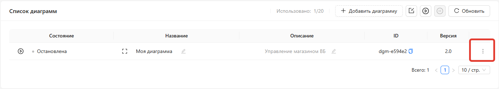

# Диаграммы

**Диаграммы** - визуальные схемы, на которых строится логика автоматизации. На ней вы размещаете модули на холсте и соединяете их между собой, выстраивая нужную логику работы.

Одна диаграмма - одна автоматизация. Например, подключение вашего магазина Wildberries к MCP-серверу.

Все диаграммы хранятся внутри Команды и доступны её участникам.

# Управление

Управление Диаграммами осуществляется в разделе [Конфигурация -> Диаграммы](https://web.marketaut.ru/app/config/diagrams)

(1) Количество созданных / доступных диаграмм 
(2) Кнопка создания новой диаграммы
(3) Область отображения созданных ранее диаграмм

## Создание диаграммы

1. Перейдите в [Конфигурация -> Диаграммы](https://web.marketaut.ru/app/config/diagrams)
2. Нажмите кнопку Добавить диаграмму
3. Заполните поля
    1. **Название** - произвольное название
    2. **Описание** - произвольное описание
4. Нажмите Сохранить

После сохранения откроется пустое полотно.

Процесс настройки диаграммы описывается в разделе [Настройка диаграмм](04-diagrams-edit.md).

## Открытие диаграммы

1. Перейдите в [Конфигурация -> Диаграммы](https://web.marketaut.ru/app/config/diagrams)
2. В строке с нужной диаграммой нажмите кнопку Открыть (в виде квадрата)

Процесс настройки диаграммы описывается в разделе [Настройка диаграмм](04-diagrams-edit.md).

## Удаление диаграммы

1. Перейдите в [Конфигурация -> Диаграммы](https://web.marketaut.ru/app/config/diagrams)
2. Напротив нужной диаграммы нажмите кнопку всплывающего меню справа

3. В меню выберите **Удалить**

## Запуск и останов диаграммы

Диаграммы имеют два состояния: 
**Запущено**: все процессы, настроенные на диаграмме, работают.
**Остановлено**: диаграмма находится в состоянии редактирования, связанные с ней процессы **не работают**.

После создания любая диаграмма находится в состоянии **Остановлено** до момента, пока вы ее не настроете и не запустите вручную. 
При любых изменениях настроек диаграммы она автоматически останавливается.
После завершения настройки для начала работы диаграмму следует **запустить**.

Запустить диаграмму можно двумя способами: из общего списка и из окна настройки самой диаграммы.

**Из общего списка**
1. Перейдите в [Конфигурация -> Диаграммы](https://web.marketaut.ru/app/config/diagrams)
2. Напротив нужной диаграммы нажмите кнопку запуска (3)

**Из окна настройки диаграммы**
1. Перейдите в [Конфигурация -> Диаграммы](https://web.marketaut.ru/app/config/diagrams)
2. Откройте нужную диаграмму
3. В окне настройки диаграммы нажмите кнопку запуска 

Процесс настройки диаграммы описывается в разделе [Настройка диаграмм](04-diagrams-edit.md).