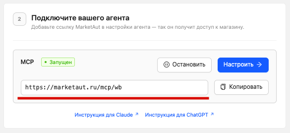

# Работа с ИИ

После создания аккаунта, настройки и запуска диаграммы вы можете подключить ИИ-агента к платформе MarketAut.

Для подключения используется MCP-адрес, который доступен на  [Домашней страницe](../3-start/02-home.md)

> Для каждого узла MCP формируется отдельный адрес подключения. Готовый адрес можно посмотреть в описании узла MCP или на домашней странице MarketAut.

## Что такое MCP

MCP  — это протокол, который позволяет ИИ-агентам безопасно подключаться к платформе MarketAut и использовать доступные инструменты.

После подключения агент сможет выполнять действия в соответствии с настройками вашей диаграммы. Например:

- получать информацию о товарах;
- работать с отзывами и вопросами покупателей;
- просматривать заказы и возвраты;
- изменять цены и скидки;
- использовать другие доступные инструменты платформы.

Набор доступных возможностей зависит от настроек диаграммы и предоставленных разрешений.

## Что понадобится для подключения

Для подключения любого ИИ-агента потребуется:

- действующий аккаунт MarketAut;
- настроенная и запущенная диаграмма;
- MCP-адрес узла МСР;
- учётная запись выбранного ИИ-сервиса.

После подготовки этих данных можно переходить к инструкции по подключению выбранного ИИ-агента.
## Выберите ИИ-агента для подключения 

- Подключить [Grok](03-grok.md)
- Подключить [Claude](01-claude.md)
- Подключить [ChatGPT](02-chat-gpt.md)
