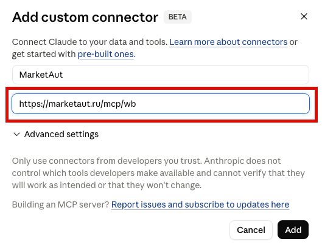
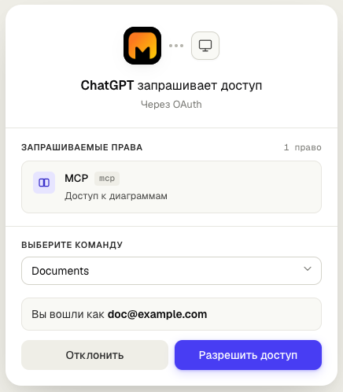
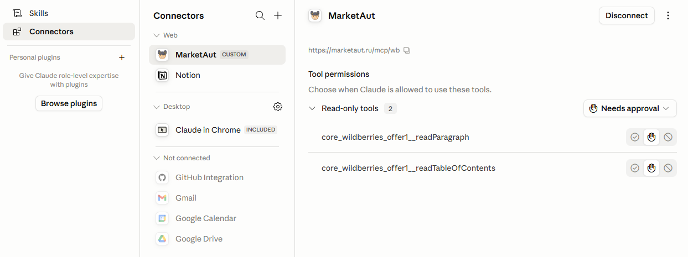
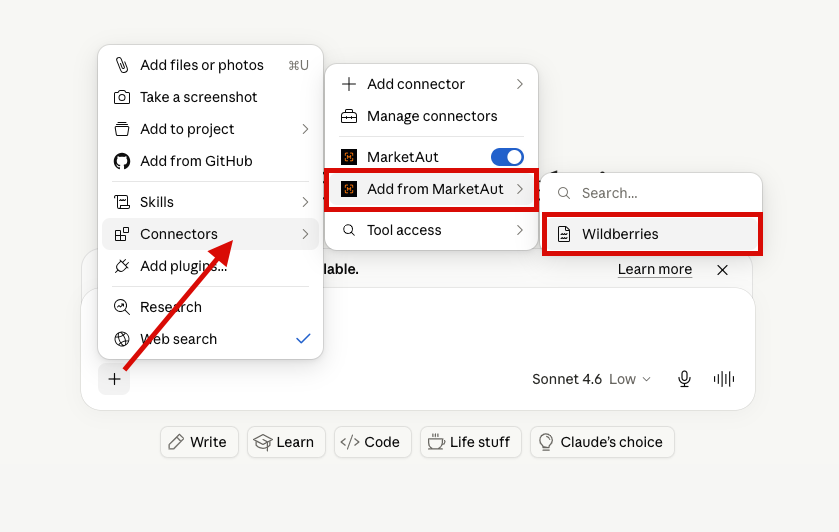

# Общая информация

В этом разделе описано подключение **Claude** к платформе MarketAut.

Подключение выполняется через протокол [MCP](https://modelcontextprotocol.io/docs/getting-started/intro).

После подключения Claude сможет использовать инструменты и данные, доступные в вашей диаграмме MarketAut, напрямую из диалога.

> В качестве примера используется Claude Desktop.
# Подключение

1. Запустите приложение **Claude for Desktop**;
2. В разделе **Chats** выберите **Customize**;

3. В открывшемся окне выберите **Connectors;**

**Connectors** — механизм подключения Claude к внешним системам. С его помощью Claude может получать доступ к инструментам и данным платформы MarketAut.

В разделе **Connectors** отображаются уже подключённые коннекторы и доступные подключения.

4. Для подключения нового коннектора нажмите кнопку **+** и выберите **Add custom connector**;

Откроется окно настройки **Connectors**.

Заполните следующие поля:

- **Имя** — любое удобное название, например `MarketAut`.
- **Адрес** — MCP-адрес вашей диаграммы, полученный на домашней странице MarketAut.

Пример MCP-адреса:
`https://marketaut.ru/mcp/wb`

После заполнения полей нажмите **Add**.

После добавления коннектора **MarketAut** появится в списке подключений, но будет отображаться как неподключённый.

Для продолжения настройки нажмите **Connect**.

После нажатия кнопки **Connect** откроется страница авторизации MarketAut.

В окне предоставления доступа нажмите **Разрешить доступ**.

После успешной авторизации Claude получит доступ к инструментам и данным, доступным в вашей диаграмме MarketAut.

После завершения подключения статус коннектора изменится на **«Подключён»**.

# Работа с Claude

## Проверка подключения

В любом диалоге Claude нажмите кнопку **(+)** рядом с полем ввода сообщения и выберите **Connectors**.

Если подключение настроено корректно, в списке коннекторов будет отображаться **MarketAut** (или другое имя, указанное при настройке подключения).

## Обновление инструментов

После изменения списка инструментов в MarketAut необходимо обновить список инструментов в Claude.

Для этого перейдите в раздел **Customize**.

Далее откройте раздел **Connectors**.

Выберите нужный коннектор, нажмите на кнопку меню **(⋯)** в правом верхнем углу и выберите **Refresh tools list**.

## Настройка доступа к инструментам

Для каждого инструмента можно отдельно настроить способ доступа.

Доступны следующие варианты:

1. **Полный запрет** — Claude не сможет использовать инструмент;
2. **Подтверждение перед каждым использованием** — перед вызовом ;инструмента потребуется подтверждение пользователя;
3. **Использование без подтверждения** — Claude сможет использовать инструмент без дополнительных запросов.

Для настройки перейдите в раздел **Customize** и откройте коннектор **MarketAut**.

В правой части окна отображается список доступных инструментов. Для каждого инструмента можно выбрать один из режимов доступа:

В правой части окна отображается список доступных инструментов. Для каждого инструмента можно выбрать один из режимов доступа:

Значки режимов доступа:

- ✔ — использование без подтверждения
- ✋ — подтверждение перед использованием
- 🚫 — полный запрет
## Добавление ресурсов через Add from MarketAut

Функция **Add from MarketAut** позволяет добавлять доступные ресурсы MarketAut в текущий диалог или проект Claude.

Использование этой функции не является обязательным для работы с платформой. При необходимости ресурсы можно добавить вручную в процессе работы.

Если в вашей диаграмме доступны ресурсы для добавления в Claude, в меню появится пункт **Add from MarketAut**.

После выбора ресурс будет добавлен в текущий диалог или проект.

Claude сможет использовать добавленные ресурсы при обработке запросов.

> **Важно**
>
> Пункт **Add from MarketAut** отображается только для ресурсов, поддерживающих добавление в Claude.

Чтобы добавить ресурс:

1. Нажмите кнопку **+** рядом с полем ввода сообщения;
2. Выберите **Connectors**;
3. Откройте **Add from MarketAut**;
4. Выберите нужный ресурс, например **Wildberries**.

После добавления ресурс станет доступен в текущем диалоге или проекте.