# Общая информация

В этом разделе описано подключение **Claude** к платформе MarketAut.

Подключение выполняется через протокол [MCP](https://modelcontextprotocol.io/docs/getting-started/intro).

После подключения Claude сможет использовать инструменты и данные, доступные в вашей диаграмме MarketAut, напрямую из диалога.

Перед началом подключения убедитесь, что:

- аккаунт Wildberries успешно создан и настроен;
- диаграмма создана, настроена и запущена;
- получен MCP-адрес на домашней странице MarketAut.

> **Важно**
>
> Добавление собственного MCP-коннектора доступно в [веб-версии Claude](https://claude.ai/) и в приложении [Claude Desktop](https://claude.ai/download). В этой инструкции подключение показано на примере Claude Desktop.

## Установка Claude Desktop

Скачайте Claude Desktop с [официальной страницы Claude](https://claude.ai/download).

Установите приложение, запустите его и войдите в свой аккаунт.
# Подключение

1. Запустите приложение **Claude Desktop**;
2. В боковом меню выберите **Customize**;
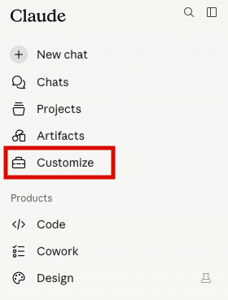
3. Откройте раздел **Connectors;**

**Connectors** — механизм подключения Claude к внешним системам. С его помощью Claude может получать доступ к инструментам и данным платформы MarketAut.

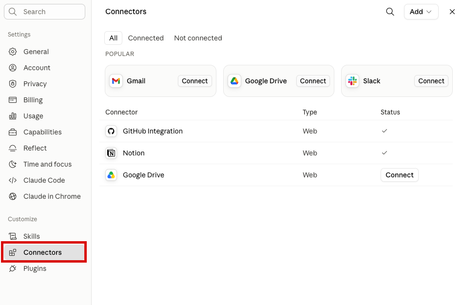
Чтобы добавить новый коннектор:
4. Нажмите кнопку **Add** и нажмите **Add custom connector**;
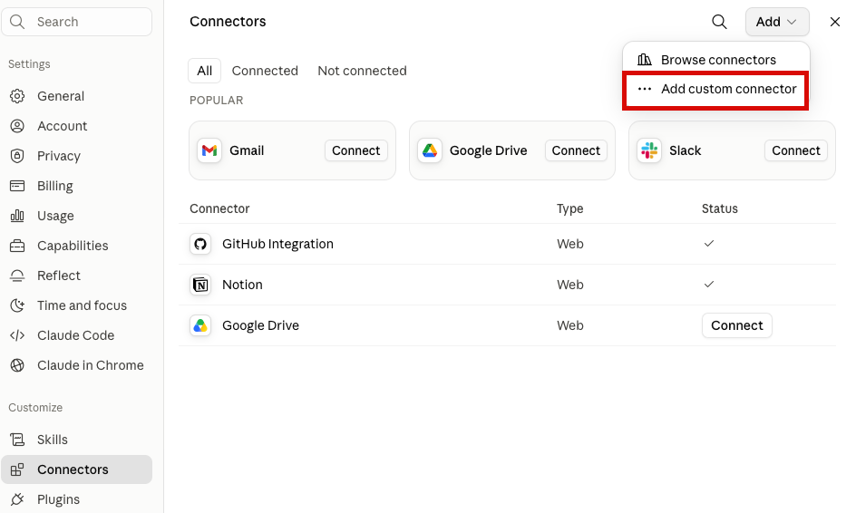

Откроется окно добавления коннектора.

Заполните следующие поля:

- **Имя** — любое удобное название, например `MarketAut`.
- **Адрес** — MCP-адрес вашей диаграммы, полученный на домашней странице MarketAut.

Пример MCP-адреса:
`https://marketaut.ru/mcp/wb`

После заполнения полей нажмите **Add**.

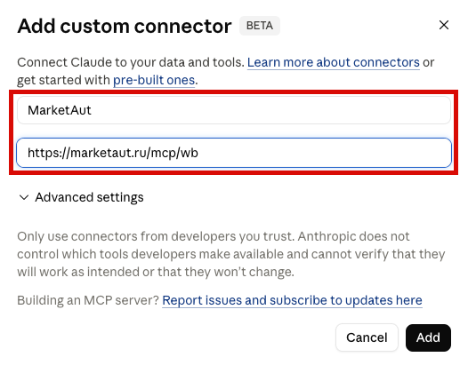

После добавления коннектора **MarketAut** появится в списке подключений, но будет отображаться как неподключённый.

Для продолжения настройки нажмите **Connect**.

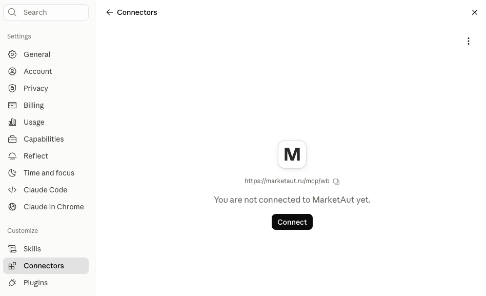

После нажатия кнопки **Connect** откроется страница авторизации MarketAut.

В окне предоставления доступа нажмите **Разрешить доступ**.
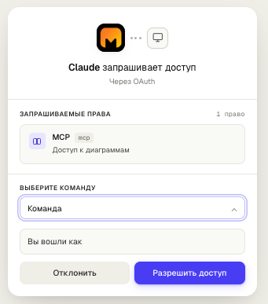

После успешной авторизации Claude получит доступ к инструментам и данным, доступным в вашей диаграмме MarketAut.

После завершения подключения рядом с коннектором появится отметка подключения, а на его странице — кнопка **Disconnect**.

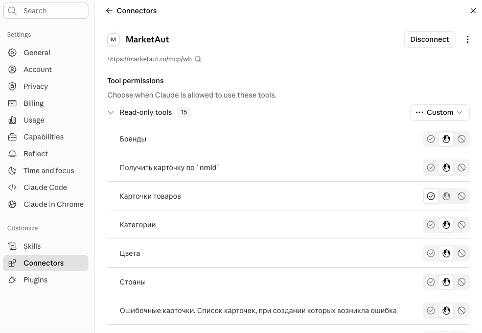

# Работа с Claude

## Проверка подключения

В любом диалоге Claude нажмите кнопку **(+)** рядом с полем ввода сообщения и выберите **Connectors**.

Если подключение настроено корректно, в списке коннекторов будет отображаться **MarketAut** (или другое имя, указанное при настройке подключения).
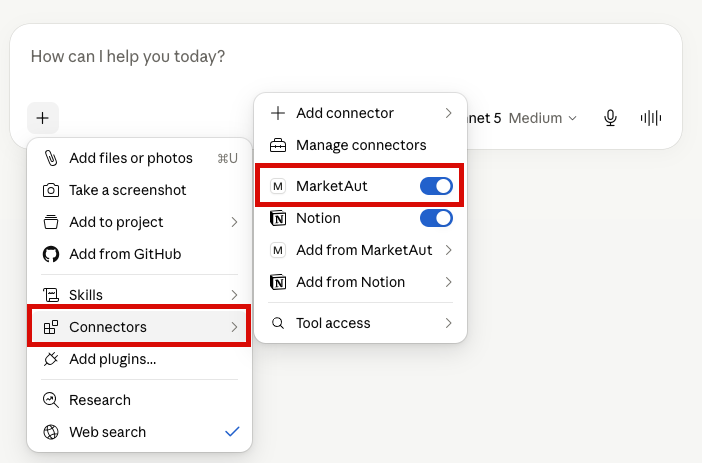
## Пример запроса

Чтобы проверить работу инструментов MarketAut:

1. Откройте новый диалог Claude;
2. Нажмите кнопку **(+)** рядом с полем ввода сообщения;
3. Выберите **Connectors**;
4. Убедитесь, что коннектор **MarketAut** включён;
5. Задайте вопрос о вашем магазине, например:

> Выведи список неотвеченных вопрсов в моём магазине??

Claude обратится к доступным инструментам MarketAut и выведет полученные данные в диалоге.
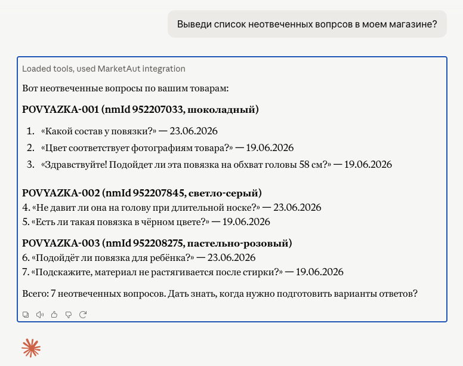

Если Claude получил данные из MarketAut, подключение настроено корректно.
## Обновление инструментов

После изменения списка инструментов в MarketAut необходимо обновить список инструментов в Claude.

1. Перейдите в раздел **Customize**;
2. Откройте раздел **Connectors** и выберите **MarketAut**;
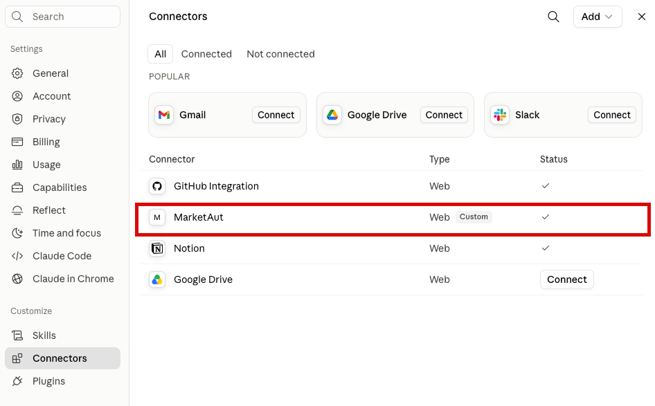
3. Откройте меню **(⋮)** и выберите **Refresh tools list**.

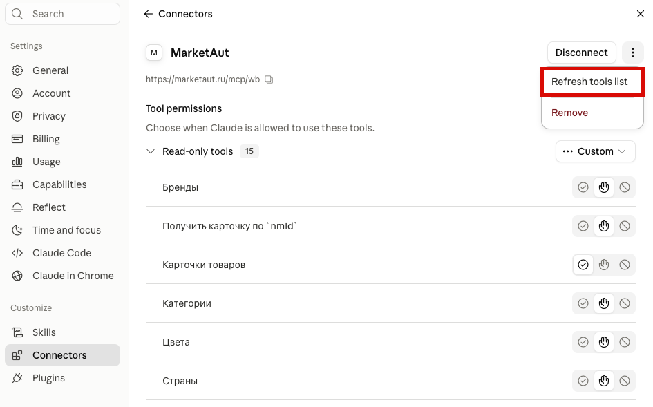

## Настройка доступа к инструментам

Для каждого инструмента можно отдельно настроить способ доступа.

Доступны следующие варианты:

1. **Использование без подтверждения** — Claude сможет использовать инструмент без дополнительных запросов;
2. **Подтверждение перед каждым использованием** — перед вызовом инструмента потребуется подтверждение пользователя;
3. **Полный запрет** — Claude не сможет использовать инструмент.

Для настройки перейдите в раздел **Connectors** и откройте коннектор **MarketAut**.

В правой части окна отображается список доступных инструментов. Для каждого инструмента можно выбрать один из режимов доступа:

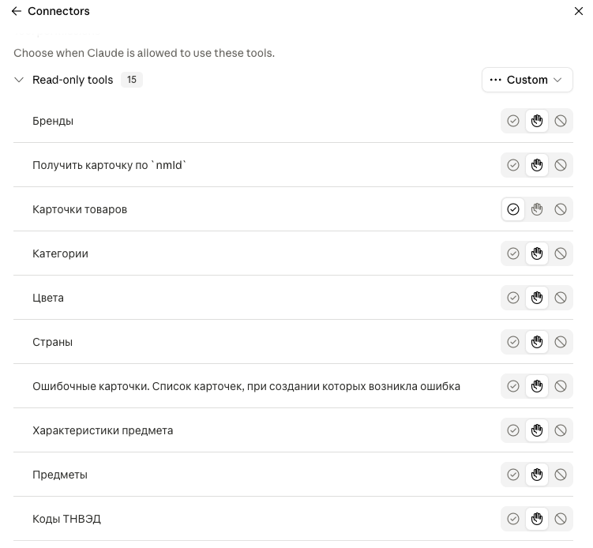

В правой части окна отображается список доступных инструментов. Для каждого инструмента можно выбрать один из режимов доступа:

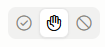
Значки режимов доступа:

- ✔ — использование без подтверждения
- ✋ — подтверждение перед использованием
- 🚫 — полный запрет
## Добавление ресурсов через Add from MarketAut

Функция **Add from MarketAut** позволяет добавлять доступные ресурсы MarketAut в текущий диалог или проект Claude.

Использование этой функции не является обязательным для работы с платформой. При необходимости ресурсы можно добавить вручную в процессе работы.

Если в вашей диаграмме доступны ресурсы для добавления в Claude, в меню появится пункт **Add from MarketAut**.

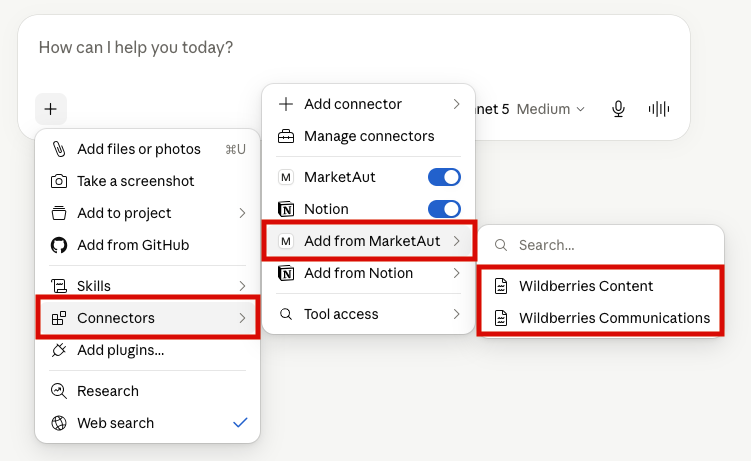
После выбора ресурс будет добавлен в текущий диалог или проект.

Claude сможет использовать добавленные ресурсы при обработке запросов.

> **Важно**
>
> Пункт **Add from MarketAut** отображается только для ресурсов, поддерживающих добавление в Claude.

Чтобы добавить ресурс:

1. Нажмите кнопку **+** рядом с полем ввода сообщения;
2. Выберите **Connectors**;
3. Откройте **Add from MarketAut**;
4. Выберите нужный ресурс, например **Wildberries Content**.

После добавления ресурс станет доступен в текущем диалоге или проекте.