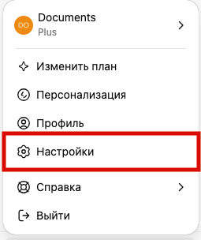
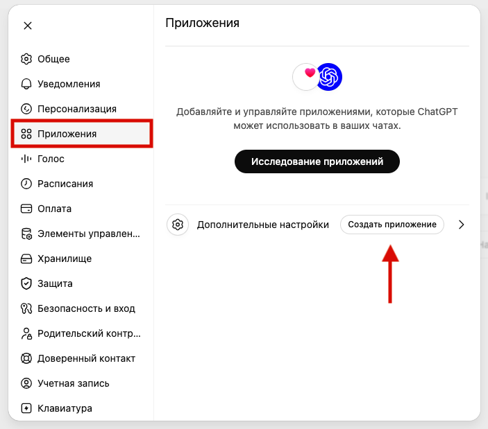
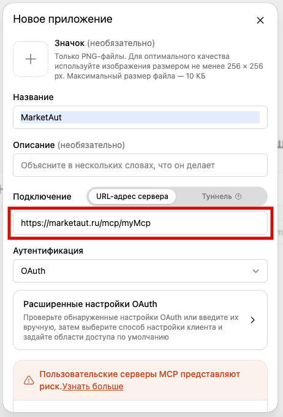
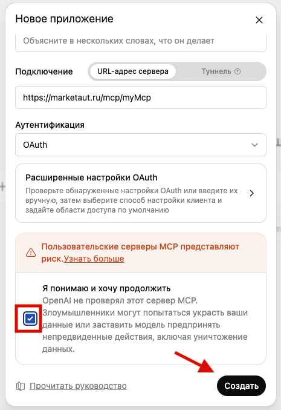
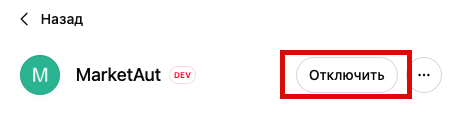
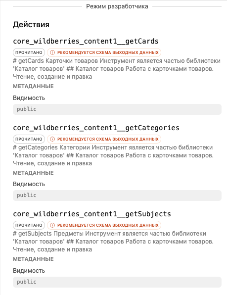
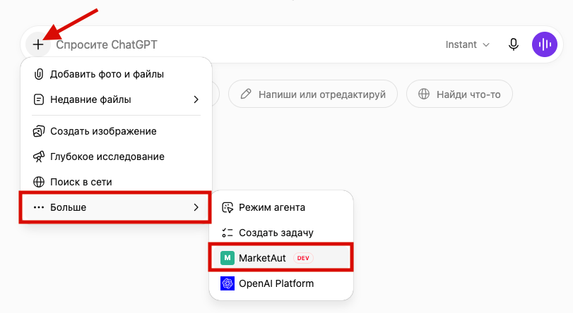
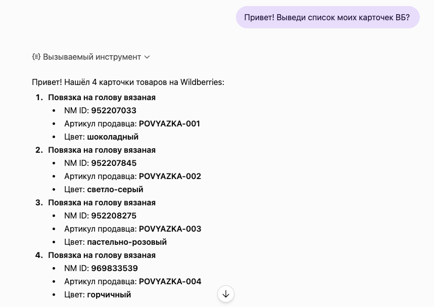
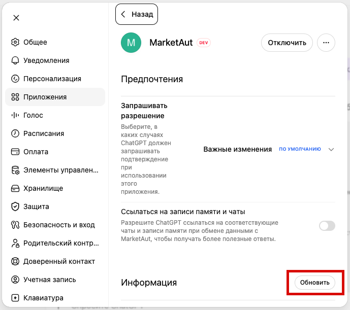

# Общая информация

В этом разделе описан процесс подключение **ChatGPT** к платформе MarketAut. 

Подключение выполняется через протокол [MCP](https://modelcontextprotocol.io/docs/getting-started/intro) . 

После подключения ChatGPT сможет использовать инструменты и ресурсы, доступные в вашей диаграмме MarketAut, напрямую из диалога.

Перед началом подключения убедитесь, что:

- аккаунт Wildberries успешно создан и настроен;
- диаграмма создана, настроена и запущена;
- получен MCP-адрес на домашней странице MarketAut.
# Подключение

1. В левом нижнем углу окна ChatGPT нажмите на значок профиля и выберите **Настройки**;

2. Перейдите в раздел **Приложения;**
3. Нажмите **Создать приложение**.

Откроется окно создания нового приложения ChatGPT.
4. Заполните следующие значения:

- **Название** — любое название на ваш выбор, например `MarketAut`;
- **Подключение** — URL-адрес MCP-сервера;
- **Аутентификация** — `OAuth`.

Скопируйте MCP-адрес из блока подключения агента на домашней странице MarketAut и вставьте его в поле **Подключение**.

Например: `https://marketaut.ru/mcp/myMCP`

Заполните поле подключения вашим MCP-адресом и убедитесь, что в качестве способа аутентификации выбран **OAuth**.

После заполнения всех полей установите флажок подтверждения и нажмите **Создать**.

5. Далее нажмите **Войти через  MarketAut**;
6. Откроется страница авторизации MarketAut;
7. В окне предоставления доступа нажмите **Разрешить доступ**.

После завершения подключения приложение появится в разделе **Приложения**.

Откройте приложение, чтобы просмотреть информацию о подключении и список доступных инструментов MarketAut.

Если список инструментов отображается, приложение успешно подключено к MarketAut и готово к использованию.
# Работа с ChatGPT

## Проверка подключения

Для проверки подключения откройте новый диалог ChatGPT.

Нажмите кнопку **+** рядом с полем ввода сообщения и выберите:

**Больше → Режим агента → MarketAut**

После выбора агента MarketAut он будет подключён к текущему диалогу.

Для проверки отправьте запрос, например:

> Привет! Выведи список моих карточек WB.

Если подключение настроено корректно, ChatGPT сможет обратиться к инструментам MarketAut и получить данные из вашего магазина Wildberries.

## Обновление инструментов

После изменения списка инструментов в диаграмме MarketAut необходимо обновить приложение в ChatGPT.

Для обновления приложения откройте:

**Настройки → Приложения → MarketAut** и нажмите **Обновить**.

После обновления ChatGPT получит актуальный список инструментов из вашей диаграммы MarketAut.