# Общая информация

В этом разделе описан процесс подключения **ChatGPT** к платформе MarketAut по протоколу [MCP](https://modelcontextprotocol.io).

После подключения ChatGPT сможет использовать инструменты и ресурсы, доступные в вашей диаграмме MarketAut, напрямую из диалога.

Перед началом подключения убедитесь, что:

- аккаунт Wildberries успешно создан и настроен — [Настройка аккаунта](/4-platform/01-accounts/); 
- диаграмма создана, настроена и запущена — [Создание и запуск диаграммы ](/4-platform/03-diagrams/); 
- получен MCP-адрес на домашней странице MarketAut — [Где найти MCP-адрес ](/3-start/02-home/).

> **Важно**
>
> Добавление собственного MCP-коннектора выполняется в [веб-версии ChatGPT](https://chatgpt.com/). Доступность функции зависит от тарифа и прав пользователя в рабочем пространстве. В этой инструкции подключение показано на примере веб-версии ChatGPT.

## Видеоинструкция

[Смотреть на YouTube →](https://youtu.be/SSZb-vkRHB4)

[Смотреть на RuTube →](https://rutube.ru/video/3cb0bcead19957f75e6739333b8cdc1f/)

## Подключение 

1. В левом меню ChatGPT откройте **Плагины**;

   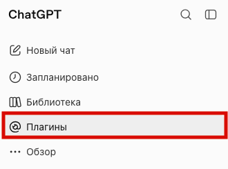

2. Справа нажмите **Добавить** и выберите **Создать MCP-приложение**;

   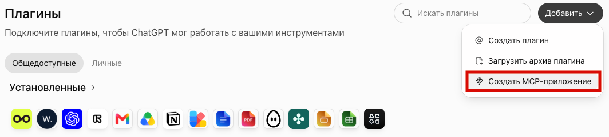

3. На домашней странице MarketAut скопируйте MCP-адрес из блока **«Подключите вашего агента»**;

   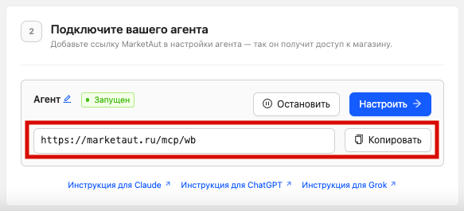

4. Заполните форму создания приложения:

   - **Название**  — любое название на ваш выбор, например `Wildberries`
   - **Описание** — можно оставить пустым;
   - **Подключение** — URL-адрес MCP-сервера;
   - **Аутентификация** — `OAuth`.
   
Скопируйте MCP-адрес из блока подключения агента на [домашней странице MarketAut](https://marketaut.ru/app/home) и вставьте его в поле **Подключение**.

Например: `https://marketaut.ru/mcp/wb`

   Установите флажок подтверждения условий и нажмите **Создать**.

  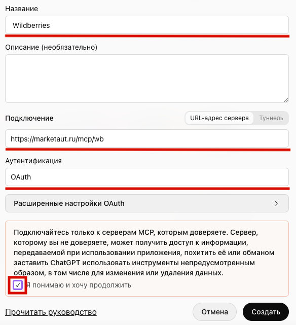

5. Нажмите **Перейти к Wildberries**.

   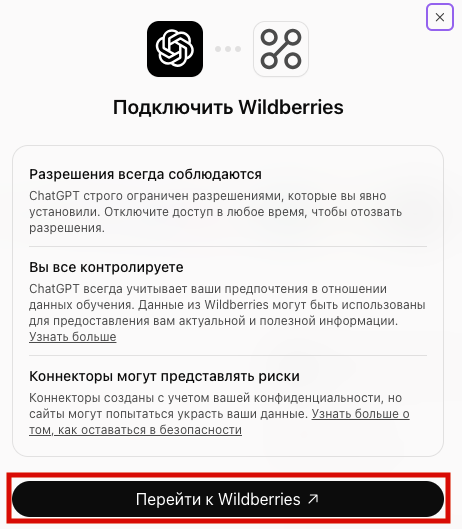

6. В открывшемся окне авторизации нажмите **Разрешить доступ**.

   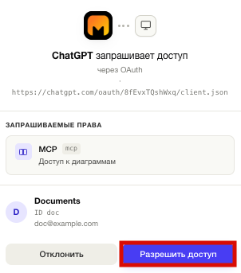

## Проверка подключения

Откройте **Плагины → Личные**. В разделе созданных вами плагинов появится **Wildberries**.

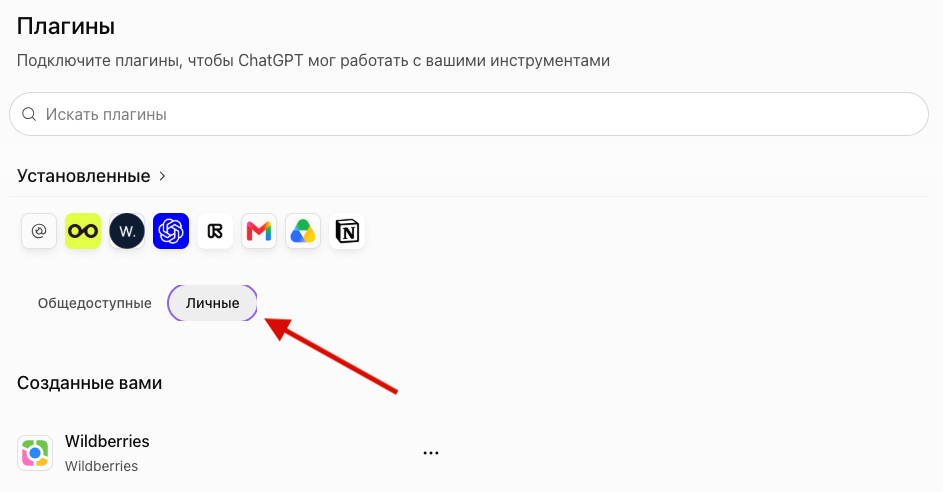

Нажмите на Wildberries, чтобы открыть его страницу.

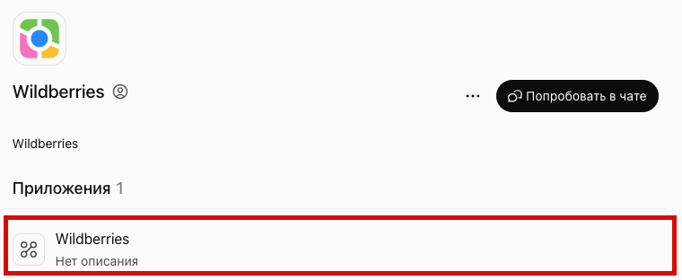

Чтобы посмотреть доступные инструменты, откройте приложение **Wildberries** в блоке **«Приложения»** на этой странице. Инструменты будут показаны по группам.

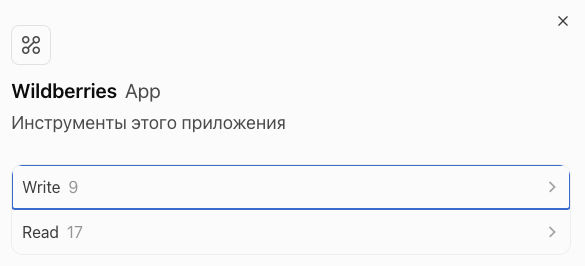

## Проверка в чате

Нажмите **Попробовать в чате** на странице Wildberries. Также можно открыть новый чат, нажать **«+»** возле поля ввода и выбрать Wildberries.

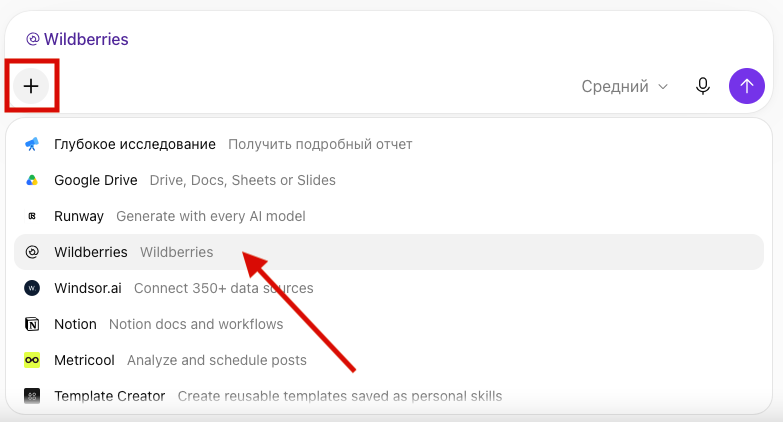

Отправьте запрос, например:

> Проанализируй цены конкурентов на повязки для волос и предложи, какую цену выставить мне.

Если подключение работает, ChatGPT обратится к инструментам Wildberries и подготовит ответ.

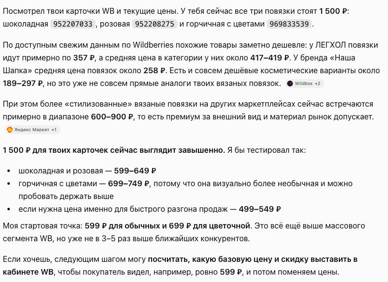

### Обновление инструментов

Если вы добавили новые узлы на диаграмму MarketAut, сначала убедитесь, что диаграмма **запущена**. Остановленная диаграмма не работает, и её инструменты будут недоступны в ChatGPT.

Откройте **Плагины → Личные → Wildberries**. Нажмите на три точки справа и выберите **«Управлять»**.

  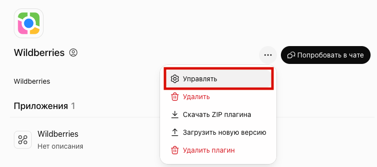

Прокрутите страницу вниз и нажмите **«Обновить инструменты»**. После обновления проверьте список инструментов приложения Wildberries.
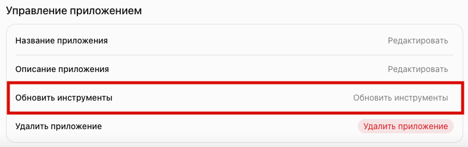
## Удаление плагина

Откройте страницу Wildberries, нажмите **«…»** справа и выберите **Удалить плагин**.

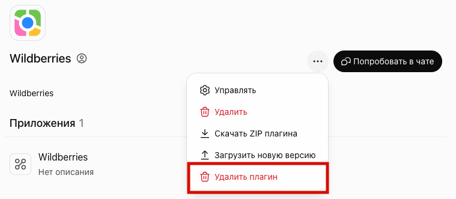