# Общая информация

В этом разделе описан процесс подключения **ChatGPT** к платформе MarketAut. 

Подключение выполняется через протокол [MCP](https://modelcontextprotocol.io/docs/getting-started/intro). 

После подключения ChatGPT сможет использовать инструменты и ресурсы, доступные в вашей диаграмме MarketAut, напрямую из диалога.

Перед началом подключения убедитесь, что:

- аккаунт Wildberries успешно создан и настроен;
- диаграмма создана, настроена и запущена;
- получен MCP-адрес на домашней странице MarketAut.
## Подключение 

1. В правом верхнем углу окна ChatGPT выберите раздел **Плагины**;

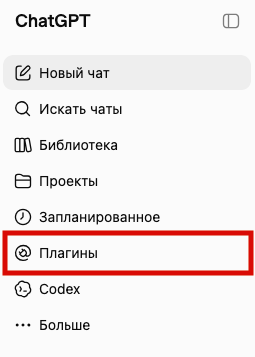
2. Нажмите  **Добавить плагин**;

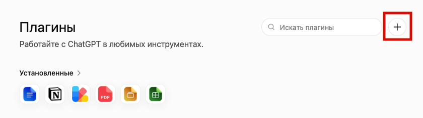

## Если отсутствует кнопка «+»

Если рядом со строкой поиска в разделе **Плагины** отсутствует кнопка **«+»**, необходимо включить режим разработчика.

- Откройте настройки

Откройте меню профиля и перейдите в **Настройки**.

- Перейдите в раздел Плагины

Откройте раздел **Плагины** и найдите пункт **Режим разработчика**.

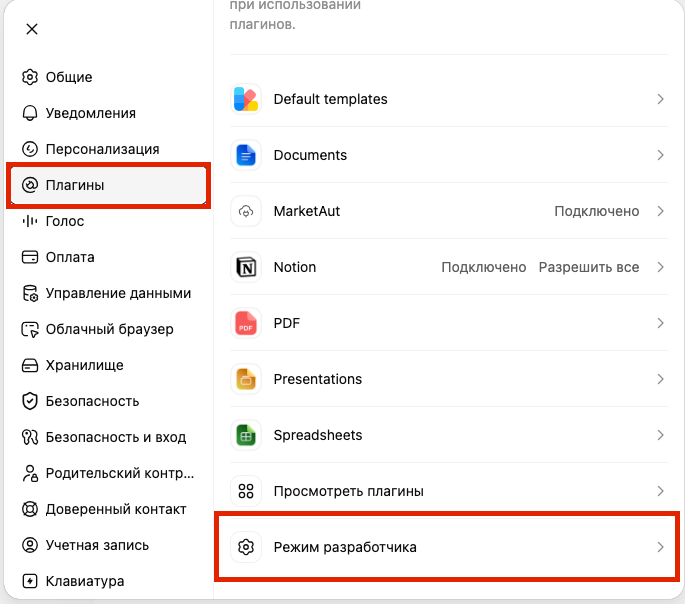
 * Включите режим разработчика

Включите переключатель **Режим разработчика**.

При включении может появиться предупреждение **Повышенный риск**. Это стандартное уведомление о том, что режим разработчика позволяет подключать неподтверждённые MCP-коннекторы.

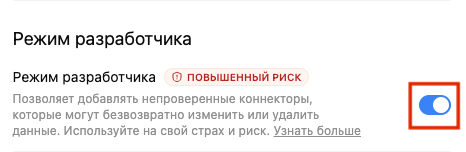
 * Продолжите подключение

Вернитесь в раздел **Плагины**. После включения режима разработчика рядом со строкой поиска появится кнопка **«+»**, и вы сможете продолжить подключение плагина.

Если пункт **Режим разработчика** отсутствует, обновите ChatGPT до последней версии или откройте веб-версию ChatGPT.
3. Заполните поля:

После нажатия кнопки **«+»** откроется окно добавления плагина.

- **Название** — любое название на ваш выбор, например `MarketAut`;
- **Подключение** — URL-адрес MCP-сервера;
- **Аутентификация** — `OAuth`.

Скопируйте MCP-адрес из блока подключения агента на домашней странице MarketAut и вставьте его в поле **Подключение**.

Например: `https://marketaut.ru/mcp/myMCP`

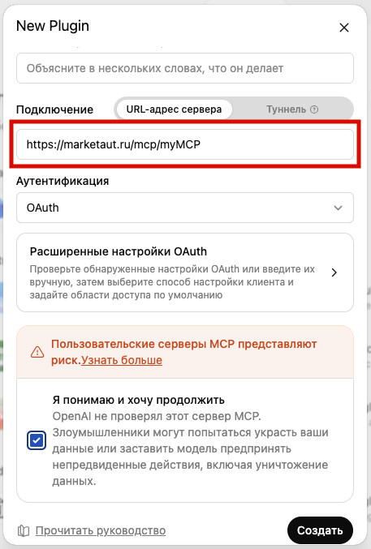

Заполните поле подключения вашим MCP-адресом и убедитесь, что в качестве способа аутентификации выбран **OAuth**.

После заполнения всех полей установите флажок подтверждения и нажмите **Создать**.

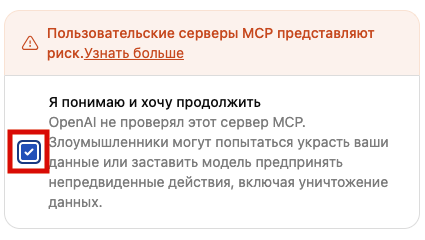
4. Далее нажмите **Войти через  MarketAut**;
5. Откроется страница авторизации MarketAut;
6. В окне предоставления доступа нажмите **Разрешить доступ**.

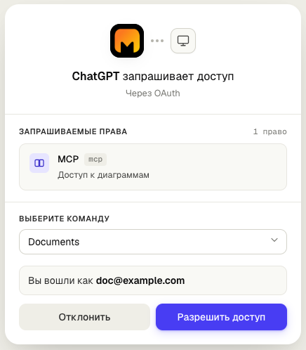

После успешного подключения плагин **MarketAut** появится в разделе **Плагины → Личные**.

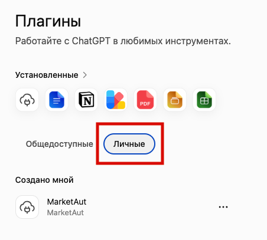
Откройте плагин **MarketAut**.

В правом верхнем углу нажмите **Настройки**.

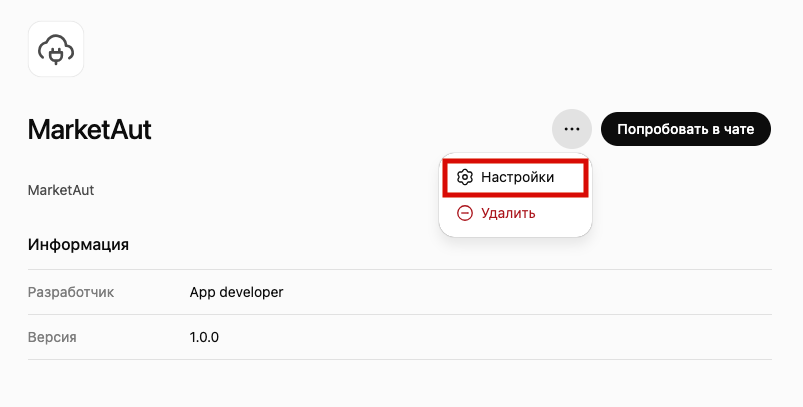

В открывшемся окне будет отображаться информация о подключении и список доступных инструментов MarketAut. При необходимости обновите список инструментов.

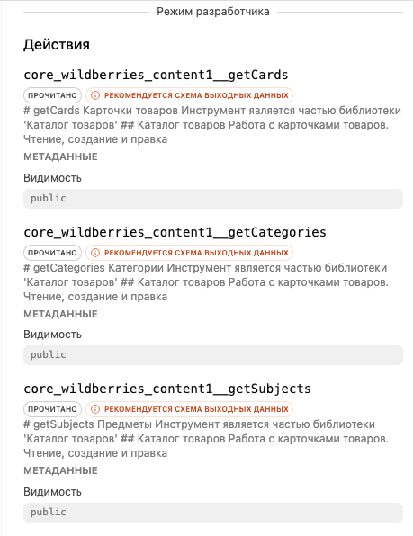

Если список инструментов отображается, подключение успешно завершено.
## Использование ChatGPT

Откройте новый диалог ChatGPT.

Нажмите кнопку **+** рядом с полем ввода сообщения и выберите **MarketAut**.

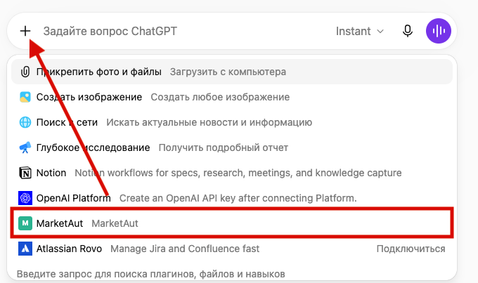

Если **MarketAut** отображается в списке, плагин успешно подключён и готов к использованию.

Отправьте любой запрос, например:

> Привет! Выведи список моих карточек WB.

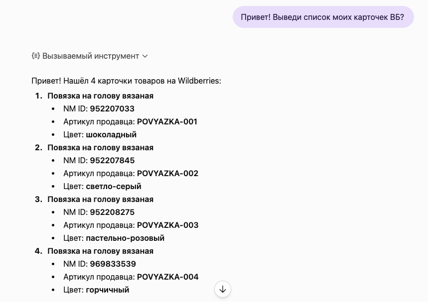

Если подключение настроено корректно, ChatGPT сможет обратиться к инструментам MarketAut и получить данные из вашего магазина Wildberries.

## Обновление инструментов MarketAut в ChatGPT

Если в MarketAut появились новые инструменты или были обновлены существующие, обновите их список в ChatGPT.

### Переход к настройкам MarketAut

1. В боковом меню ChatGPT откройте раздел **«Плагины»**.

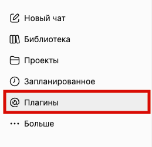
2. В блоке **«Установленные»** выберите **MarketAut**.
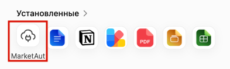
3. Нажмите на три точки в правом верхнем углу и выберите **«Настройки»**.
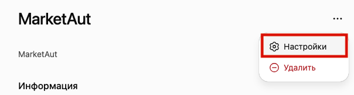

### Обновление списка инструментов

Прокрутите страницу вниз до раздела **«Информация»** и нажмите **«Обновить»**.

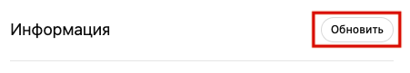

После обновления создайте новый чат и проверьте работу инструментов MarketAut.

### Повторное подключение

Если после обновления новые инструменты не появились, нажмите на три точки в настройках MarketAut и выберите **«Подключить повторно»**.

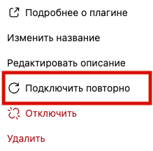

При необходимости снова подтвердите авторизацию. После повторного подключения создайте новый чат.