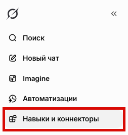
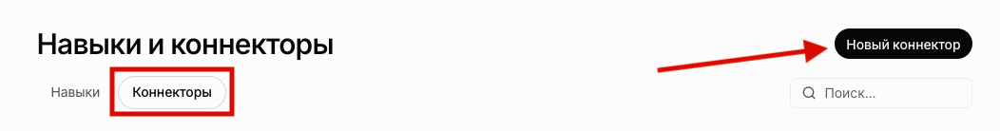
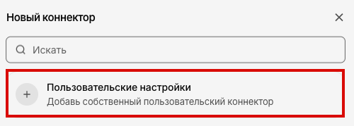
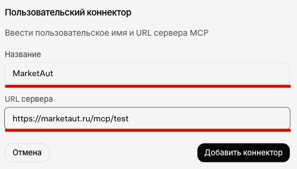
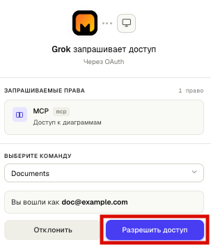
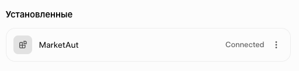
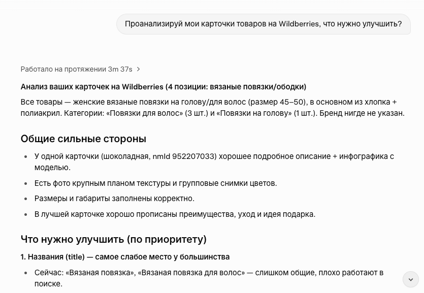

# Общая информация

В этом разделе описан процесс подключения **Grok** к платформе MarketAut.

Подключение выполняется через протокол [MCP](https://modelcontextprotocol.io/docs/getting-started/intro).

После подключения Grok сможет использовать инструменты и ресурсы, доступные в вашей диаграмме MarketAut, напрямую из диалога.

Перед началом подключения убедитесь, что:

- аккаунт Wildberries успешно создан и настроен;
- диаграмма создана, настроена и запущена;
- получен MCP-адрес на домашней странице MarketAut.

## Подключение

1. В боковом меню Grok выберите раздел **«Навыки и коннекторы»**.

2. Перейдите во вкладку **«Коннекторы»** и нажмите **«Новый коннектор»**.

3. В открывшемся окне выберите **«Пользовательские настройки»**.

4. Заполните поля:

- **Название**: укажите любое удобное название коннектора, например `MarketAut`;
- **URL сервера**: вставьте персональный MCP-адрес, скопированный из блока подключения агента на домашней странице MarketAut.

Например: `https://marketaut.ru/mcp/test`

После заполнения полей нажмите **«Добавить коннектор»**.

5. Откроется окно предоставления доступа. При необходимости выберите нужную команду и нажмите **«Разрешить доступ»**.

После успешного подключения MarketAut появится в разделе **«Установленные»** со статусом `Connected`.

Если отображается статус `Connected`, подключение успешно завершено.

## Использование Grok

Откройте новый диалог Grok и отправьте запрос, для выполнения которого необходимы данные вашего магазина Wildberries.

Например:

> Проанализируй мои карточки товаров на Wildberries, что нужно улучшить?

Если подключение настроено корректно, Grok сможет обратиться к инструментам MarketAut и получить данные из вашего магазина Wildberries.