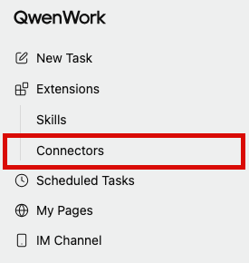
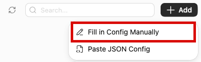
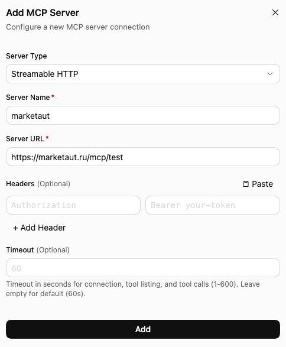
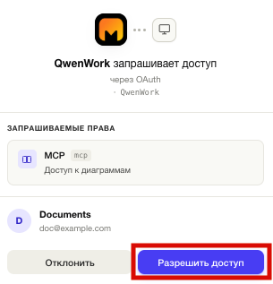
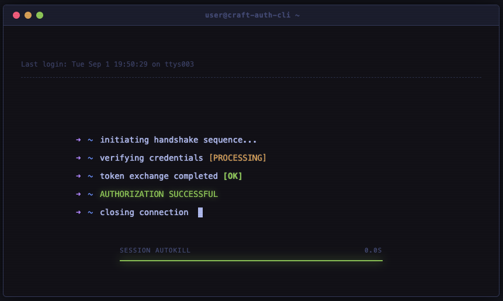
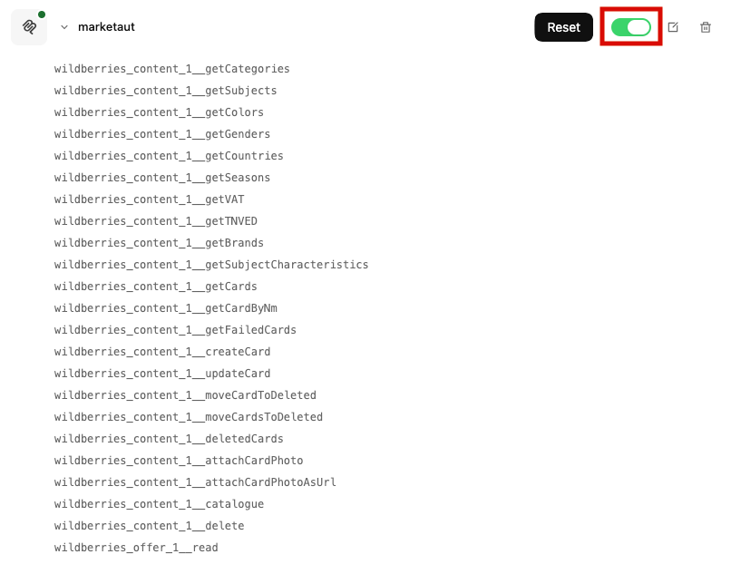
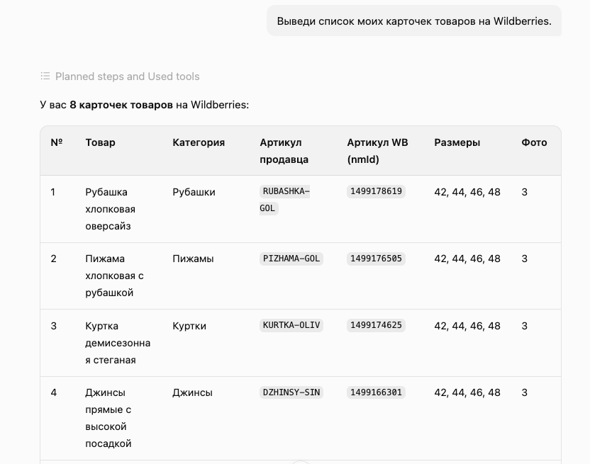
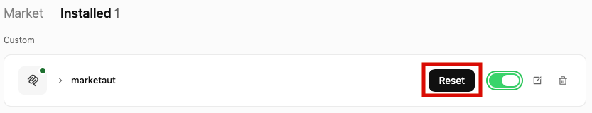

# Общая информация

В этом разделе описан процесс подключения **QwenWork** к платформе MarketAut.

Подключение выполняется через протокол [MCP](https://modelcontextprotocol.io).

После подключения QwenWork сможет использовать инструменты и данные, доступные в вашей диаграмме MarketAut, напрямую из диалога.

Перед началом подключения убедитесь, что:

- аккаунт Wildberries успешно создан и настроен;
- диаграмма создана, настроена и запущена;
- получен MCP-адрес на домашней странице MarketAut.

> **Важно**
>
> Добавление собственного MCP-коннектора доступно только в приложении QwenWork для компьютера. В веб-версии QwenWork кнопка добавления пользовательского коннектора отсутствует. Скачать приложение можно на [официальном сайте QwenWork](https://qwenwork.ai/).

## Установка QwenWork

1. Перейдите на официальный сайт [QwenWork](https://qwenwork.ai/);
2. Скачайте приложение для своей операционной системы;
3. Установите и запустите QwenWork;
4. Войдите в свой аккаунт.

## Подключение

1. Запустите приложение QwenWork;
2. В боковом меню откройте раздел **Extensions**;
3. Выберите **Connectors**.

4. В правом верхнем углу нажмите **+ Add**;
5. Выберите **Fill in Config Manually**.

Откроется окно **Add MCP Server**.

Заполните следующие поля:

- **Server Type** — выберите `Streamable HTTP`;
- **Server Name** — укажите удобное название без пробелов, например `marketaut`;
- **Server URL** — вставьте персональный MCP-адрес, скопированный из блока подключения агента на домашней странице MarketAut;
- **Headers** — оставьте пустыми;
- **Timeout** — оставьте пустым или укажите `60`.

Пример MCP-адреса:

`https://marketaut.ru/mcp/test`

> Название сервера не должно содержать пробелы. Если поле подсвечивается красным и появляется сообщение `Server name cannot contain spaces`, удалите пробелы и повторно введите название, например `marketaut`.

После заполнения полей нажмите **Add**.

## Авторизация

После добавления MCP-сервера откроется страница авторизации MarketAut.

Проверьте запрашиваемые права и нажмите **Разрешить доступ**.

После успешной авторизации появится сообщение:

`AUTHORIZATION SUCCESSFUL`

Дождитесь завершения процесса авторизации. Авторизация завершена, когда появляется сообщение `AUTHORIZATION SUCCESSFUL`, а зелёная полоса в нижней части окна доходит до конца.

После этого окно можно закрыть вручную и вернуться в приложение QwenWork.

## Проверка подключения

1. Откройте **Extensions → Connectors**;
2. Перейдите во вкладку **Installed**;
3. Найдите коннектор `marketaut`;
4. Раскройте коннектор;
5. Убедитесь, что переключатель справа включён и отображается зелёным цветом.

Зелёный переключатель означает, что коннектор MarketAut активен и QwenWork может использовать его инструменты в задачах.

Ниже названия коннектора отображается список доступных инструментов MarketAut.

Если переключатель включён и инструменты отображаются в списке, подключение успешно завершено.

Чтобы временно запретить QwenWork использовать MarketAut, выключите переключатель. Удалять коннектор для этого не требуется.

## Использование QwenWork

Откройте новую задачу QwenWork и отправьте запрос, для выполнения которого необходимы данные вашего магазина Wildberries.

Например:

> Выведи список моих карточек товаров на Wildberries.

QwenWork обратится к доступным инструментам MarketAut и выведет полученные данные.

Если QwenWork получил данные из MarketAut, подключение настроено корректно.

## Обновление инструментов

Если в диаграмме MarketAut появились новые инструменты или были изменены существующие, обновите их список в QwenWork.

1. Откройте **Extensions → Connectors**;
2. Перейдите во вкладку **Installed**;
3. Найдите коннектор `marketaut`;
4. Нажмите кнопку **Reset**.

Кнопка **Reset** перезапускает подключение к MarketAut и заново загружает актуальный список инструментов.

При необходимости повторно подтвердите авторизацию. После обновления раскройте коннектор и проверьте список доступных инструментов.