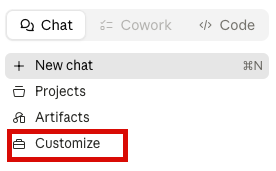

# Общая информация

В этом разделе описано подключение ИИ-агентов (Claude, ChatGPT, Gemini и др.) к платформе MarketAut.

В качестве примера используется **Claude** от Anthropic. При этом большинство современных ИИ-агентов поддерживают протокол [MCP](https://modelcontextprotocol.io/docs/getting-started/intro) и могут подключаться через платформу MarketАut к вашему магазину Wildberries.

# Подключение

1) Запустите приложение **Claude for Desktop**
2) В разделе Chats выберите **Customize**

3) В открывшемся окне выберите **Connectors**

**Connectors** — это механизм подключения ИИ к внешним системам. С их помощью Claude может взаимодействовать с различными сервисами, включая Wildberries, через платформу MarketAut.

В открывшемся окне отображается список уже подключённых коннекторов.

4) Для подключения нового коннектора нажмите **(+)**, затем в открывшемся меню выберите **Add custom connector**

Откроется окно настроек **сonnectors**. 

Заполните следующие значения:
**Имя** — любое название на ваш выбор, например **`MarketAut`**
**Адрес** — **`https://marketaut.ru/mcp/wb`**

После заполнения полей нажмите **Add**.

После добавления коннектора **MarketAut** появится в списке, но будет отображаться как неподключённый. 
Нажмите **Connect**, чтобы установить подключение.

Вы будете перенаправлены на страницу авторизации **MarketAut**. 
Нажмите **Разрешить доступ**.

После завершения проверки статус коннектора изменится на «**Подключён**».

