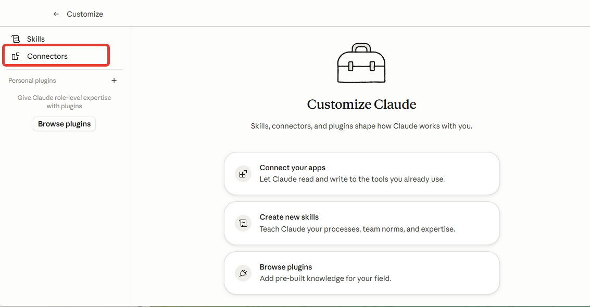
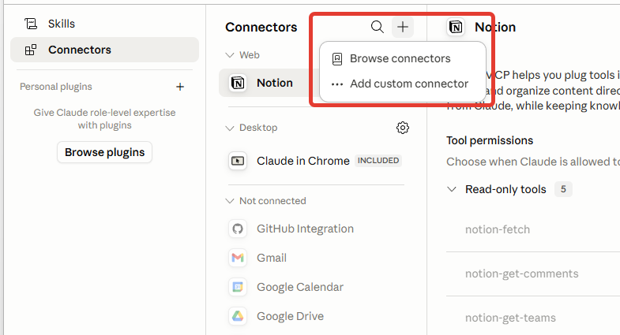
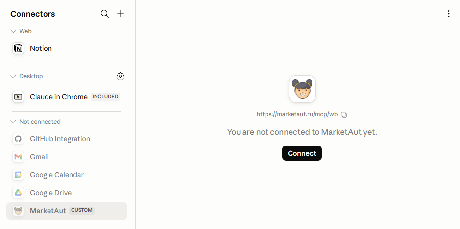
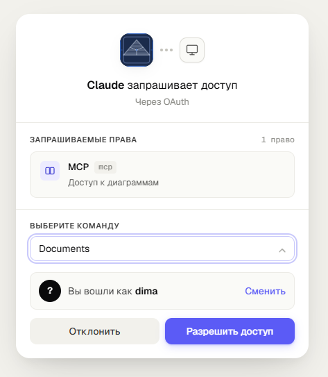
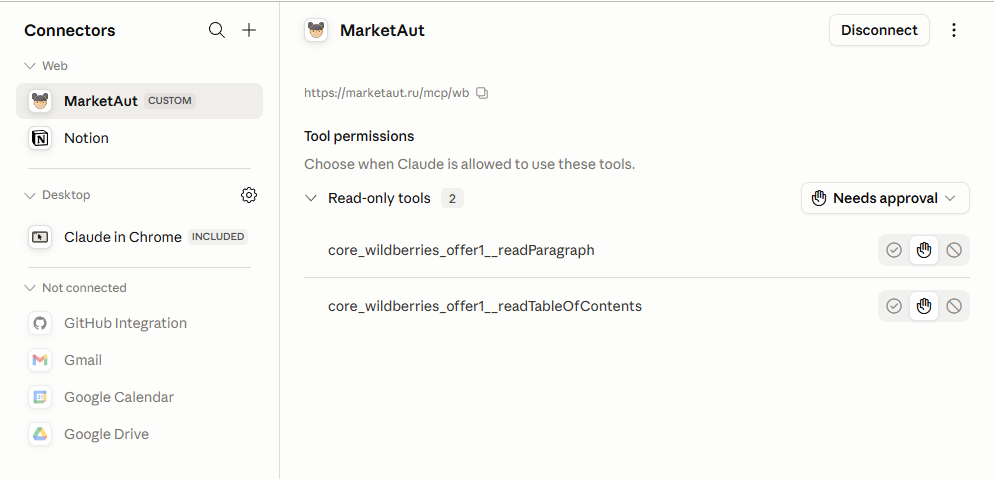

# Общая информация

Здесь описывается, как настроить подключение вашего ИИ (Claude, ChatGPT, Gemini и др).
Описание будет на примере Anthropic Claude, тем не менее все современные ИИ агенты поддерживают протокол [MCP](https://modelcontextprotocol.io/docs/getting-started/intro), то есть могут подключаться через платформу Marketaut к вашему магазину ВБ.

# Подключение

Запустите приложение Claude for Desktop

В разделе Chats выберите **Customize**. 

В открывшемся окне выберите **Connectors**. Коннекторы - это подключения вашего ИИ ко внешним системам, в том числе Wildberries.

В открывшемся окне вы увидите список уже подключенных "коннекторов" и кнопку для подключения нового.
Нажмите на **+** и в открывшемся меню **Add custom connector** для подключения нового коннектора.

Откроется окно настроек коннектора. Введите только имя и адрес.
**Имя**: Любое на ваш выбор, например, MarketAut
**Адрес**: `https://marketaut.ru/mcp/wb` 

и нажмите **Add**

**MarketAut** добавится в список коннекторов, но будет отображаться как неподключенный.
Нажмите кнопку **Connect** для подключения

Вас перенаправит на страницу входа MarketAut. 
Нажмите **Разрешить доступ**.

После проверки коннектор отобразится как подключенный

