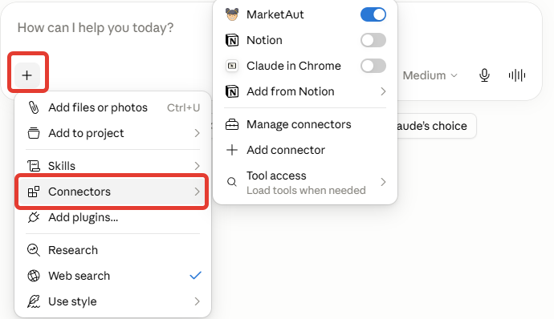
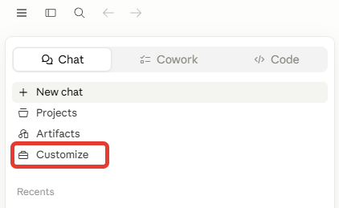
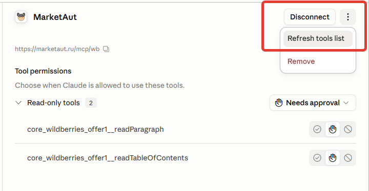
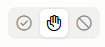

# Работа с Claude

## Проверка подключения

В любом диалоге с Claude нажмите на символ + под диалогом, далее **Connectors**.

Если подключение в порядке, то в списке коннекторов вы увидите MarketAut (он будет под тем названием, которые вы ему дали при подключении).

## Обновление инструментов

После того, как вы обновите для агента список доступных инструментов в веб-интерфейсе MarketAut, следует также их обновить в Claude

Для этого перейдите в **Customize**

Далее **Connectors**

Выберите нужный коннектор, нажмите на символ многоточия в правом верхнем углу и далее **Refresh tools list**.

## Настройка доступа к инструментами

Вы можете гибко настраивать политику доступа ИИ к каждому инструменту. 

Доступные варианты:
1. Полный запрет
2. Подтверждение перед каждым использованием
3. Свободное использование 

Для настройки перейдите в **Customize** и выберите нужный коннектор (MarketAut)

В правой части окна отобразится полный список инструментов, где для каждого можно выбрать режим доступа:

