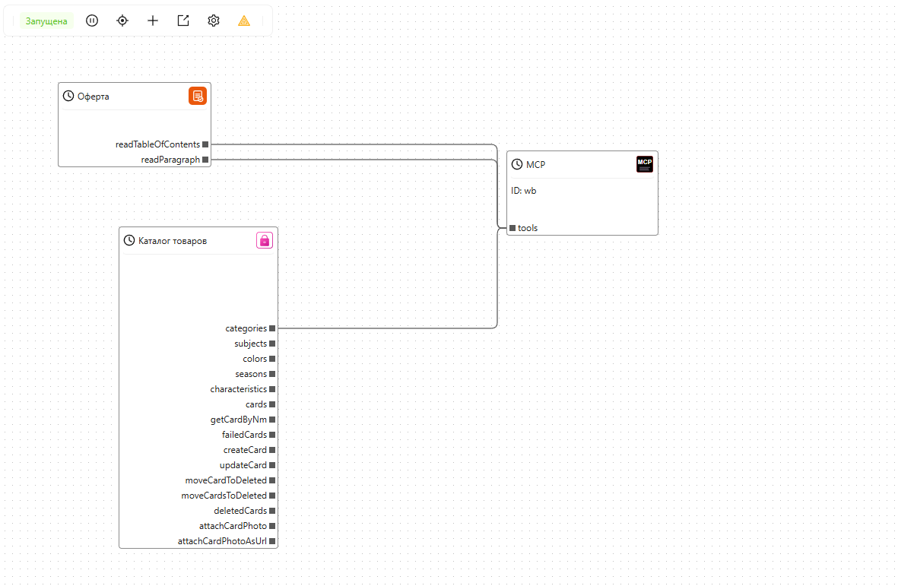

# О платформе

**MarketAut** — это платформа, которая позволяет подключать ИИ к внешним сервисам и настраивать автоматизации с помощью визуальных диаграмм.

Она позволяет создавать автоматизации и подключать ИИ-агентов без написания кода, установки дополнительных приложений и настройки сложной инфраструктуры.

[Домашняя страница проекта](https://marketaut.ru)

[Где найти документацию и как связаться с поддержкой](1-help/help.md)

[Инструкция по подключению за 10 минут](2-quick-start/quick_start.md)

[Регистрация и начало работы](3-start/register.md)

[Работа с платформой](4-platform/00-intro.md)

[Настройка ИИ агента](5-claude/01-claude-connect.md)