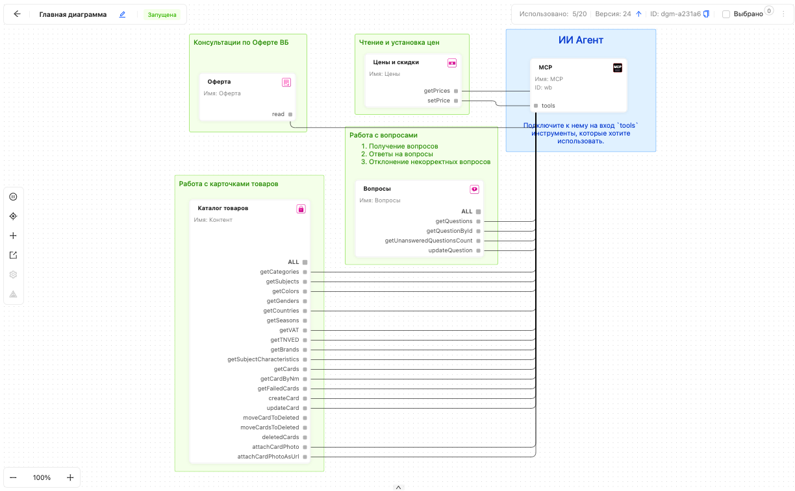

# О платформе

**MarketAut** — платформа, которая подключает ИИ к вашему магазину на Wildberries и помогает управлять бизнес-процессами через визуальные диаграммы.

Автоматизируйте процессы и подключайте ИИ-агентов без написания кода, установки дополнительных приложений и настройки сложной инфраструктуры.

# ИИ для работы с MarketAut

MarketAut может работать с языковыми моделями через протокол MCP. Благодаря этому модель может не только отвечать на вопросы, но и обращаться к подключенным инструментам и данным MarketAut.

## Варианты языковых моделей и ИИ-ассистентов

Ниже собраны популярные языковые модели и ИИ-ассистенты, которые могут быть релевантны для пользователей MarketAut.

| Модель   | Тип                                       | Поставщик     | Официальный сайт                    |
| -------- | ----------------------------------------- | ------------- | ----------------------------------- |
| ChatGPT  | ИИ-ассистент                              | OpenAI        | [chatgpt.com](http://chatgpt.com)   |
| Claude   | ИИ-ассистент                              | Anthropic     | [claude.ai](http://claude.ai)       |
| Grok     | ИИ-ассистент                              | xAI           | [grok.com](http://grok.com)         |
| QwenWork | Рабочая ИИ-платформа на базе моделей Qwen | Alibaba Cloud | [qwenwork.ai](https://qwenwork.ai/) |

## Что дает подключение к MarketAut

После подключения языковая модель сможет использовать инструменты MarketAut, доступные пользователю согласно его правам. Например, получать данные, работать с подключенными сервисами и выполнять действия через инструменты платформы. 

## Текущий статус

На текущий момент подключение к MarketAut доступно для ChatGPT, Claude, Grok и QwenWork. Инструкции по подключению размещены в разделе [Работа с ИИ](/5-ai/00-intro/).

[Домашняя страница проекта](https://marketaut.ru)

[Где найти документацию и как связаться с поддержкой](1-help/help.md)

[Инструкция по подключению за 10 минут](2-quick-start/quick_start.md)

[Регистрация и начало работы](3-start/01-register.md)

[Работа с платформой](4-platform/00-intro.md)

[Настройка ИИ агента](5-ai/00-intro.md)